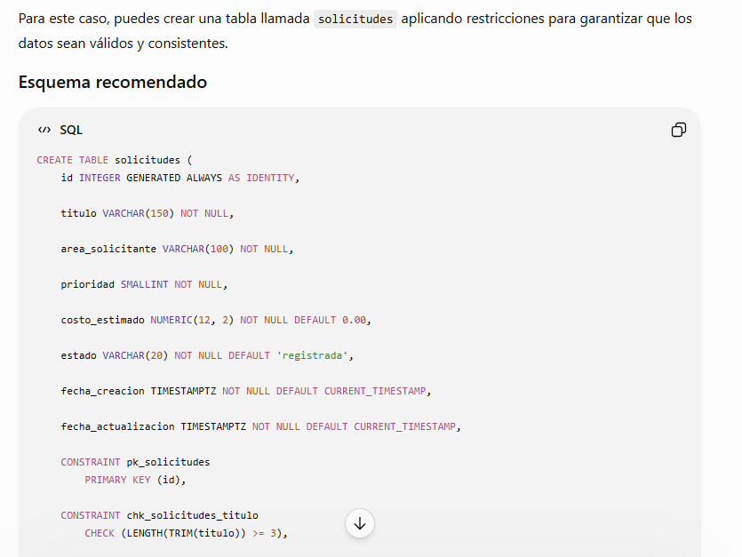
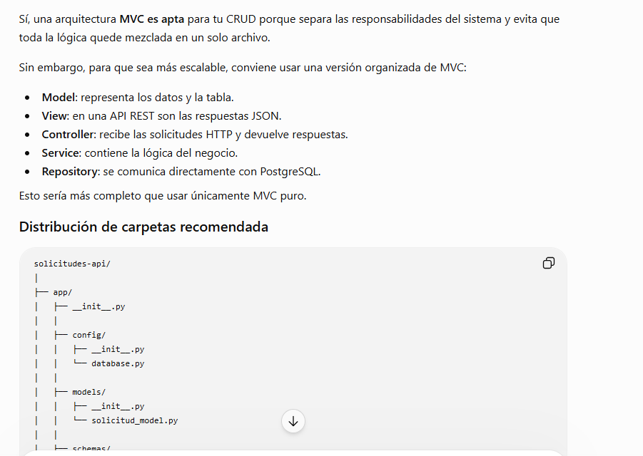

Primer Promt:
Estoy realizando una base de datos relacional utilizando PostgresSQL , alojada de manera persistente en NeonDB .Necesito que me ayudes a diseñar el esquema de la base de datos con buenas practicas de PostgresSQL , ademas de aplicar sus respectivas restricciones de (primary key,not null, etc). Teniendo en cuenta los siguientes campòs Id: Entero Titulo:string area?solictante: string prioridad:entero (entre 1 y 5 ) costo_estimado: decimal estado: string

Segundo Prompt:

Voy a trabajar con una arquitectura MVC para tener en cuenta el escalamiento en un futuro .Como tal necesito la elaboración de un CRUD que siga las convenciones REST, que sea un código limpio que siga las buenas practicas de desarrollo utilizando nombres descriptivos y evitando la duplicación de código usando el lenguaje de python. El sistema debe estar predispuesto a conectarse una base de datos PostgreSQL alojada de manera presistente en NeonDB. La API debe comunicarse meadiante formato JSON , la estructura utilizada sera la siguiente: { "titulo":"Adquisicion de nuevo servidor", "area_solicitante": "Infraestructura TI", "prioridad": 3, "costo_estimado": 2500.00, "estado": "registrada" }

