## Diagrama de Arquitectura

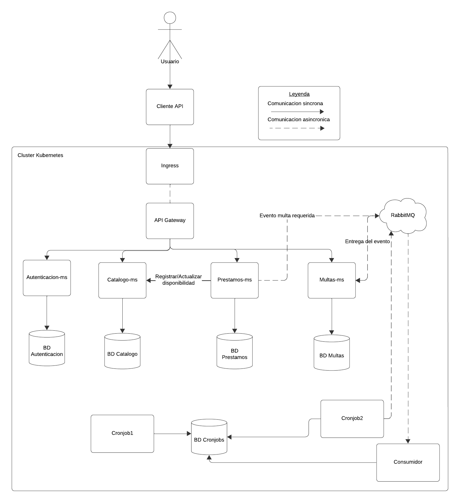

El diagrama muestra la arquitectura general del sistema de biblioteca. El usuario realiza solicitudes desde un cliente API, que ingresan al sistema por un punto de entrada y pasan al API Gateway. Este Gateway se encarga de dirigir cada solicitud al microservicio correspondiente: Autenticación, Catálogo, Préstamos o Multas.

Cada microservicio administra su propia base de datos, lo que permite mantener los componentes separados e independientes. La mayor parte de la comunicación es síncrona, por ejemplo cuando Préstamos consulta o actualiza la disponibilidad de un recurso en Catálogo.

También existe una comunicación asíncrona: cuando se genera un evento relacionado con una multa, el microservicio de Préstamos publica el evento en una cola de mensajes. Luego, el microservicio de Multas consume ese evento y lo procesa de manera independiente. Esto permite desacoplar ambos servicios y evita que Préstamos tenga que esperar a que Multas termine su proceso.

## Detalle de los Comandos utilizados

**Despliegue desde un cluster vacio**

* Iniciar Minikube

''''
minikube start \
  --driver=docker \
  --container-runtime=containerd \
  --cni=calico \
  --cpus=4 \
  --memory=8192
minikube addons enable ingress
minikube addons enable metrics-server
minikube addons enable default-storageclass
minikube addons enable storage-provisioner

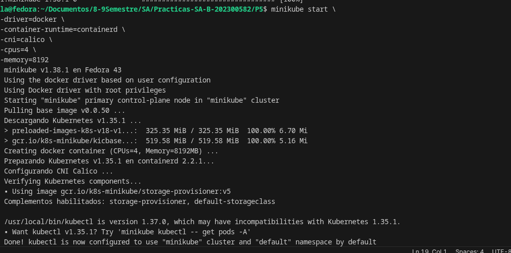

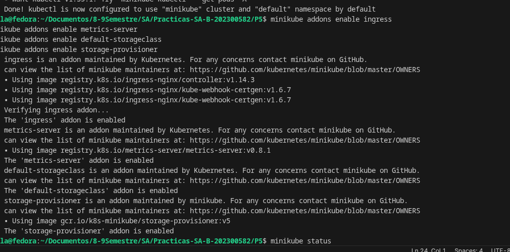

* Verificar el cluster 

minikube status
kubectl get nodes
kubectl get pods -A

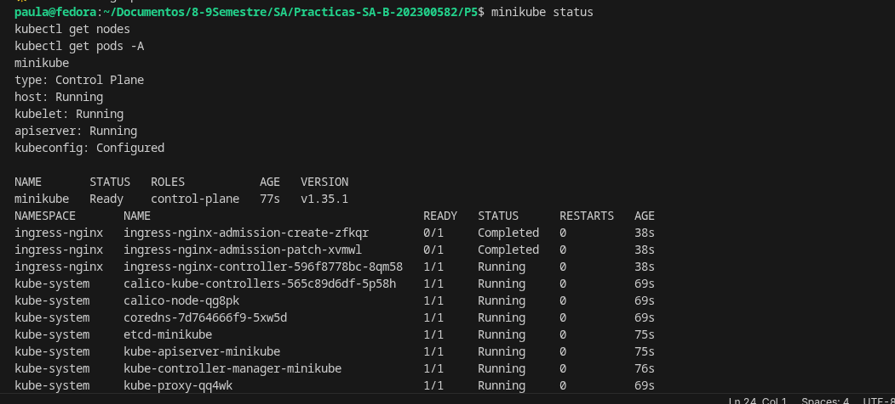

* Contruir las imagenes

docker build -t sa-p5/api-gateway:0.1.1 \
  P4/Backend/api-gateway

docker build -t sa-p5/autenticacion-ms:0.1.0 \
  P4/Backend/autenticacion-ms

docker build -t sa-p5/catalogo-ms:0.1.0 \
  P4/Backend/catalogo-ms

docker build -t sa-p5/prestamos-ms:0.2.2 \
  P4/Backend/prestamos-ms

docker build -t sa-p5/multas-ms:0.1.3 \
  P4/Backend/multas-ms

docker build -t sa-p5/cronjobs-worker:0.1.0 \
  P5/cronjobs/cronjob2

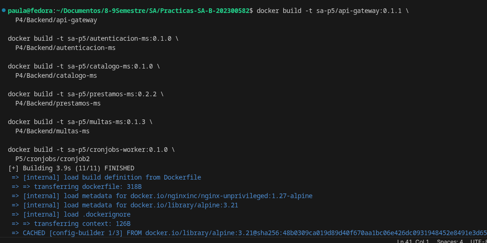

    Verificacion de las imagenes:

    docker images | grep sa-p5

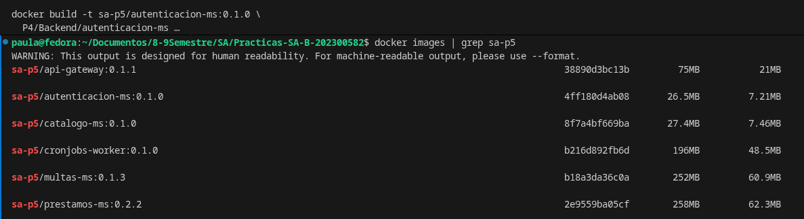

* Cargar las imagenes a minikube

minikube image load sa-p5/api-gateway:0.1.1
minikube image load sa-p5/autenticacion-ms:0.1.0
minikube image load sa-p5/catalogo-ms:0.1.0
minikube image load sa-p5/prestamos-ms:0.2.2
minikube image load sa-p5/multas-ms:0.1.3
minikube image load sa-p5/cronjobs-worker:0.1.0

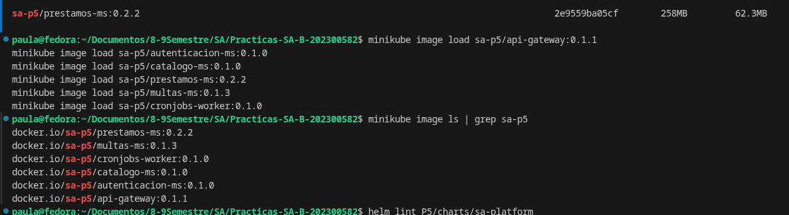

* Validar helm 

    helm lint P5/charts/sa-platform

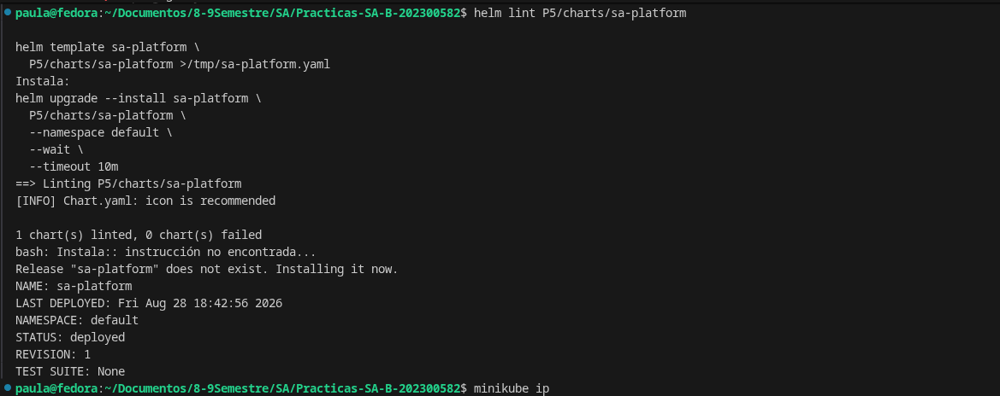

* Desplegar la plataforma

    helm upgrade --install sa-platform \
  P5/charts/sa-platform \
  -f P5/charts/sa-platform/values-dev.yaml \
  --namespace default \
  --wait \
  --timeout 10m

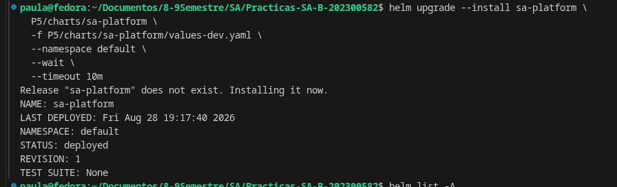

    helm list -A
    kubectl get pods -n sa-p5
    kubectl get all -n sa-p5    

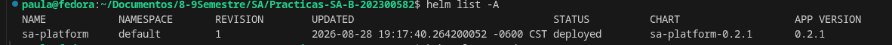

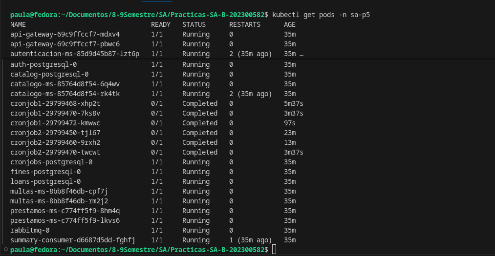

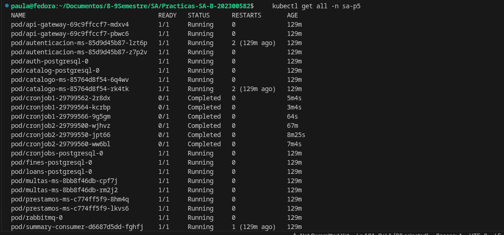

* Configurar acceso

    minikube ip: 192.168.49.2
    echo "$(192.168.49.2) biblioteca.local" |
    sudo tee -a /etc/hosts

    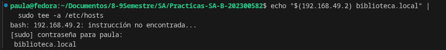

    Verificacion
    getent hosts biblioteca.local

    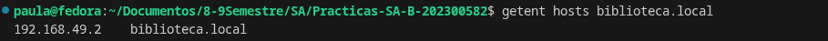
* Probar API Gateway 

    - curl http://biblioteca.local/health/auth
    - curl http://biblioteca.local/health/catalogo
    - curl http://biblioteca.local/health/prestamos
    - curl http://biblioteca.local/health/multas

    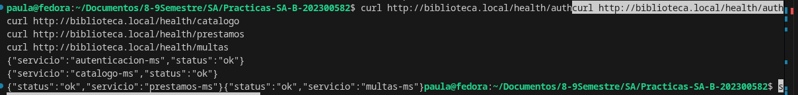

## Tabla Comparativa de imagenes

    docker images --format \
    '{{.Repository}}:{{.Tag}}\t{{.Size}}' | grep '^sa-p5/'

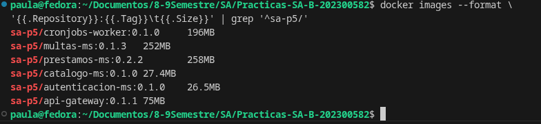

## Evidencias

* Helm history + upgrade + rollback
    helm history sa-platform -n default

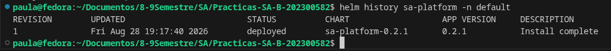

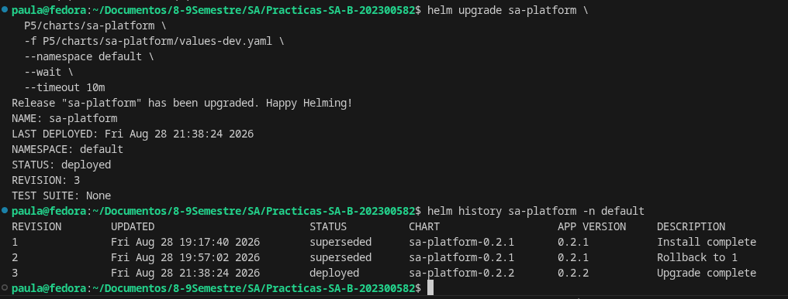

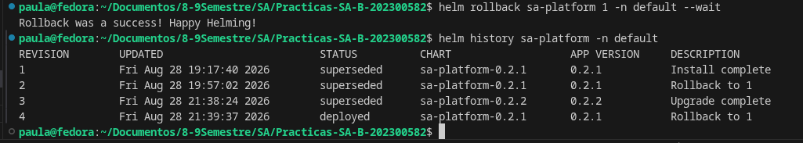

* HPA bajo carga

    - BASE_URL=http://biblioteca.local \
    k6 run P5/scripts/load-test.js

    - kubectl get hpa -n sa-p5 -w

    - kubectl get hpa -n sa-p5

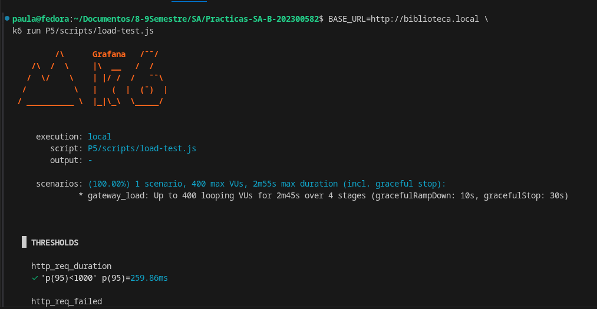

* Persistencia despues borrar postgreSQL

    kubectl exec -n sa-p5 cronjobs-postgresql-0 -- \
    sh -c 'psql -U "$POSTGRES_USER" -d "$POSTGRES_DB" -c "\dt"'

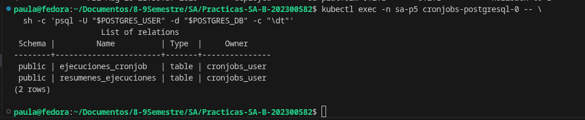

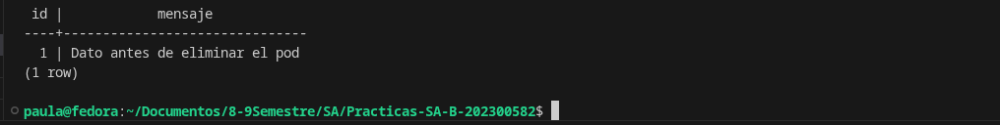

- elimnando pod

    kubectl delete pod cronjobs-postgresql-0 -n sa-p5

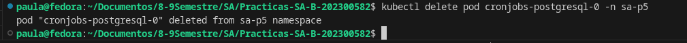

- se recrea el pod

     kubectl get pods -n sa-p5 -w

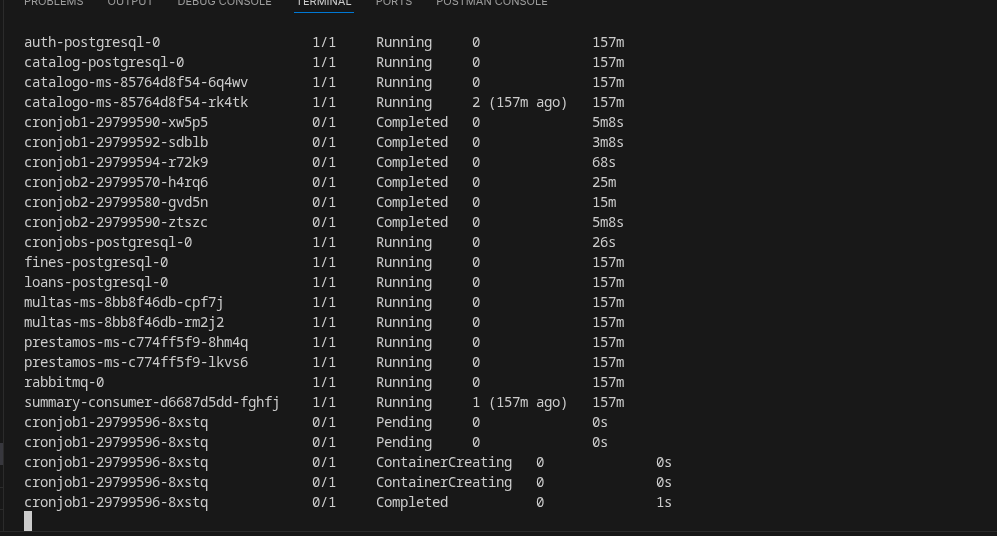

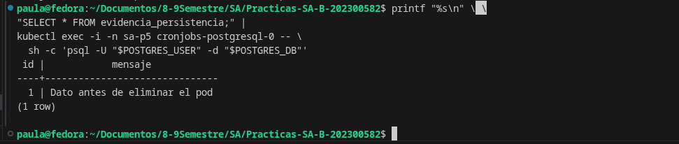

* Networkpolicy
- pod no autorizado
    kubectl run np-test \
  --image=curlimages/curl:8.12.1 \
  --restart=Never \
  -n sa-p5 \
  --command -- sleep 3600

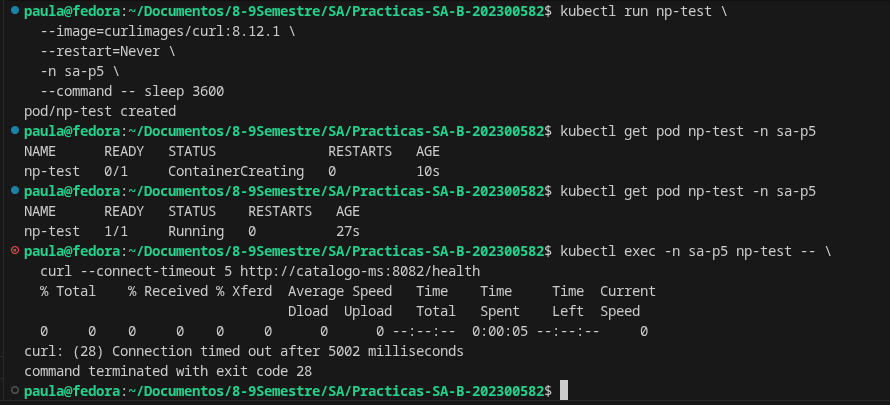

- funcionamiento por gateway

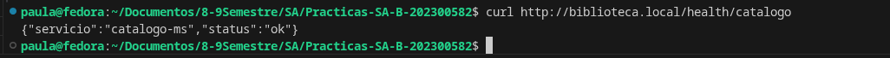

* Actaulizacion sin dowtime

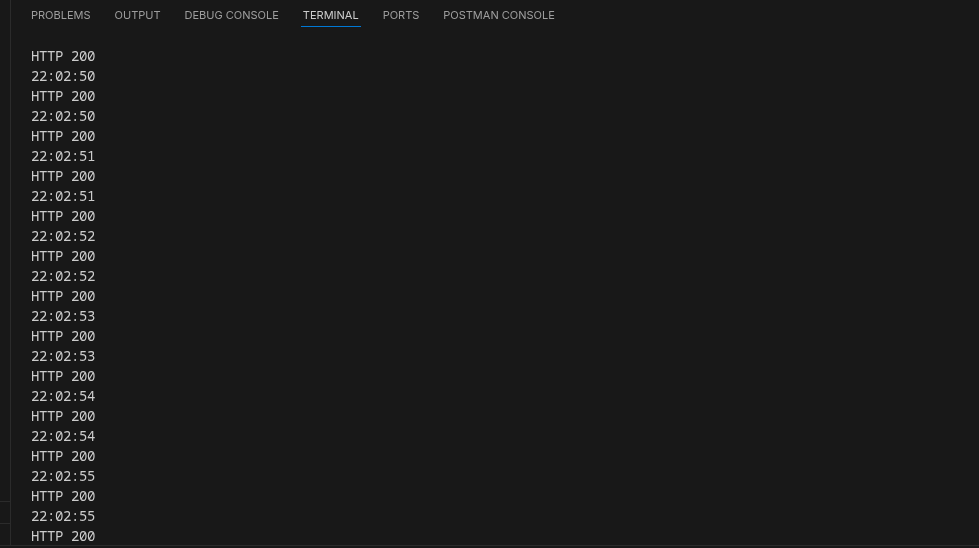

* Resultados de K6

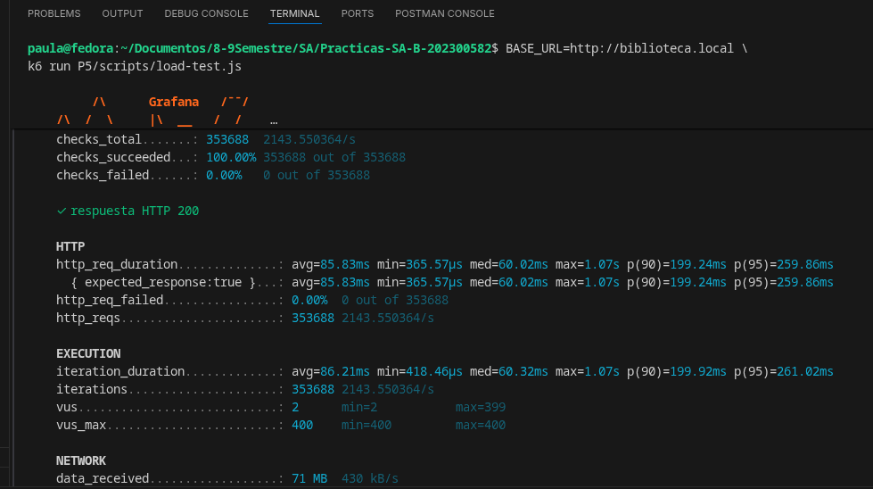

| Imagen           | Después |
| ---------------- | ------: |
| api-gateway      |   75 MB |
| autenticacion-ms | 26.5 MB |
| catalogo-ms      | 27.4 MB |
| prestamos-ms     |  258 MB |
| multas-ms        |  252 MB |
| cronjobs-worker  |  196 MB |

## Preguntas teoricas

**¿Qué es Helm y qué problema resuelve frente a los manifiestos sueltos?**

Helm es un gestor de paquetes para Kubernetes. Permite agrupar todos los archivos necesarios para desplegar una aplicación dentro de un Chart.

Frente a usar muchos manifiestos .yaml por separado, Helm permite instalar, actualizar y revertir toda una plataforma de forma centralizada y parametrizable.

**¿diferencia entre chart,release y repository?**

Chart: es el paquete que contiene las plantillas, configuraciones y dependencias necesarias para desplegar una aplicación en Kubernetes.

Release: es una instalación concreta de un Chart dentro de Kubernetes. Por ejemplo:

    helm upgrade --install sa-platform ...

sa-platform es el nombre del release.

Repository: es un lugar donde se almacenan y distribuyen Charts de Helm para poder descargarlos y reutilizarlos.

**¿qué es un StatefulSet y cuándo NO usarlo?**

Un StatefulSet es un recurso de Kubernetes diseñado para aplicaciones que necesitan mantener identidad y almacenamiento persistente.

Por ejemplo, una base de datos puede tener:

    postgresql-0

y utilizar un PVC que mantiene los datos aunque el pod sea eliminado.

No conviene usar StatefulSet cuando la aplicación no necesita conservar identidad ni almacenamiento propio. Por ejemplo, para un API Gateway o microservicio stateless normalmente se utiliza un Deployment.

**¿diferencia entre liveness, readiness y startup probe?**

Las tres verifican la salud de los contenedores, pero tienen objetivos distintos.

Liveness Probe: verifica si el contenedor sigue funcionando. Si falla repetidamente, Kubernetes lo reinicia.

Readiness Probe: verifica si el pod está listo para recibir tráfico. Si falla, Kubernetes deja de enviarle solicitudes, pero no necesariamente lo reinicia.

Startup Probe: verifica que la aplicación haya terminado correctamente su proceso de inicio. Es útil para aplicaciones que tardan en arrancar.

**¿qué es una NetworkPolicy y por qué el tráfico es permitido por defecto?**

Una NetworkPolicy define qué pods pueden comunicarse con otros pods dentro de Kubernetes.

Por defecto, los pods pueden comunicarse entre sí porque Kubernetes no aplica aislamiento de red automáticamente. El tráfico comienza a restringirse cuando se crean NetworkPolicies compatibles con el CNI utilizado.

**¿qué es un PodDisruptionBudget?**

Un PodDisruptionBudget (PDB) limita cuántos pods de una aplicación pueden quedar fuera de servicio simultáneamente debido a interrupciones voluntarias.

Por ejemplo, si tienes:

    5 pods

puedes configurar que siempre haya al menos:

    4 disponibles

Esto ayuda a mantener la disponibilidad cuando Kubernetes mueve, elimina o actualiza pods.

No impide todas las fallas posibles; principalmente protege frente a interrupciones voluntarias administradas por Kubernetes

**¿qué ventajas y qué nuevos problemas introduce la comunicación asíncrona?**

La comunicación asíncrona utiliza un broker como RabbitMQ para que un servicio publique un mensaje sin tener que esperar inmediatamente a que otro servicio termine de procesarlo.

Ventajas:

- Reduce el acoplamiento entre servicios.
- El productor puede responder más rápido.
- Los mensajes pueden quedar almacenados mientras el consumidor está caído.
- Facilita procesar cargas grandes de manera gradual.
- Puede mejorar la resiliencia.

Nuevos problemas:

- Es más difícil seguir el flujo completo de una operación.
- Puede haber mensajes duplicados.
- Hay que manejar reintentos y errores.
- Se debe garantizar durabilidad de las colas.
- Los consumidores deben ser capaces de procesar mensajes de manera segura.
- Aparece consistencia eventual.

**¿qué hace helm rollback internamente?**

helm rollback toma la configuración de una revisión anterior de un release y vuelve a aplicarla en Kubernetes.

Por ejemplo:

    helm history sa-platform -n default

puede mostrar:

    REVISION   CHART
    1          sa-platform-0.2.1
    2          sa-platform-0.2.2

Si ejecutamos:

    helm rollback sa-platform 1 -n default

Helm recupera el estado guardado de la revisión 1, calcula los cambios necesarios y actualiza los recursos de Kubernetes para volver a ese estado