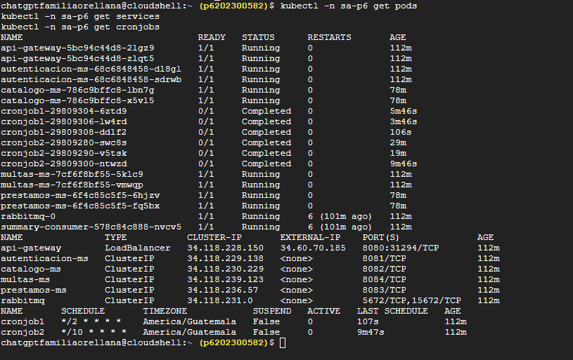
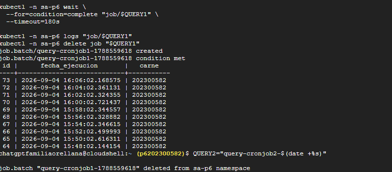
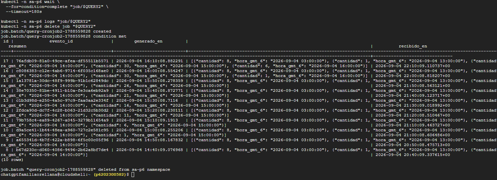

# Práctica 6 - Despliegue en Google Kubernetes Engine

Esta carpeta adapta la plataforma de la Práctica 5 para desplegarla en un clúster administrado de GKE con un nodo, imágenes privadas en Artifact Registry, PostgreSQL externo en tres instancias de Neon, RabbitMQ con almacenamiento persistente y un `LoadBalancer` público para el API Gateway. Aunque el PDF indica dos nodos, esta configuración sigue la indicación posterior de usar uno para no consumir rápidamente los créditos.

No se crean cuentas, proyectos ni bases de Neon desde estos archivos. Las cadenas de conexión terminan almacenadas como Secrets de Kubernetes y los Deployments las inyectan en los contenedores. No se necesita un archivo `.env` para GKE; el script recibe los valores temporalmente desde la sesión de PowerShell para evitar escribir credenciales en Git.

## Arquitectura preparada

- GKE zonal con un nodo `e2-standard-2` para reducir el consumo de créditos.
- Artifact Registry privado con seis imágenes: gateway, cuatro microservicios y worker de cronjobs.
- Cinco bases lógicas distribuidas entre tres instancias/proyectos de Neon.
- `Dockerfile.prod` multi-stage para cada imagen propia, con una etapa final mínima y usuario sin privilegios.
- RabbitMQ dentro del clúster, con PVC atendido por la StorageClass predeterminada de GKE.
- API Gateway publicado mediante `Service` de tipo `LoadBalancer`.
- Comunicación asíncrona `prestamos-ms -> RabbitMQ -> multas-ms` para solicitar multas, más productor/consumidor de resúmenes de cronjobs.
- NetworkPolicies con DNS, tráfico interno controlado, acceso público al gateway y salida TCP 5432 hacia Neon.

## Requisitos locales

Instale y autentique `gcloud`, Docker, `kubectl` y Helm. Debe contar con un proyecto de Google Cloud con facturación o créditos habilitados. Antes de ejecutar comandos, confirme el proyecto activo con `gcloud config get-value project`.

## 1. Crear las bases en Neon

Cree manualmente tres instancias o proyectos de Neon y distribuya las bases así:

| Instancia de Neon | Bases de datos |
|---|---|
| Neon 1 | `auth_db`, `catalogo_db` |
| Neon 2 | `prestamos_db`, `multas_db` |
| Neon 3 | `cronjobs_db` |

Cada microservicio conserva una URL propia, aunque dos URL puedan compartir el mismo host de Neon. Use URLs con `sslmode=require` y no las guarde en archivos versionados.

En PowerShell cargue las variables únicamente en la sesión actual:

```powershell
$env:AUTH_DATABASE_URL="postgresql://.../auth_db?sslmode=require"
$env:CATALOG_DATABASE_URL="postgresql://.../catalogo_db?sslmode=require"
$env:LOANS_DATABASE_URL="postgresql://.../prestamos_db?sslmode=require"
$env:FINES_DATABASE_URL="postgresql://.../multas_db?sslmode=require"
$env:CRONJOBS_DATABASE_URL="postgresql://.../cronjobs_db?sslmode=require"
$env:JWT_SECRET="una-cadena-aleatoria-de-32-o-mas-caracteres"
```

Inicialice las tablas después de crear las bases (requiere `psql`):

```powershell
.\P6\scripts\00-init-neon.ps1
```

## 2. Configurar Google Cloud y crear el clúster

Los comandos son deliberadamente parametrizados: reemplace `MI_PROYECTO` y ajuste región o zona si corresponde.

```powershell
.\P6\scripts\01-configure-gcp.ps1 -ProjectId MI_PROYECTO
```

El script habilita las API necesarias, crea un repositorio privado de Artifact Registry si falta, crea un clúster zonal de un nodo y configura `kubectl`. Revise la cuota y el costo mostrado por Google antes de mantener el clúster activo.

### Creacion de cluster


## 3. Construir y publicar imágenes

```powershell
.\P6\scripts\02-build-push.ps1 -ProjectId MI_PROYECTO
```

El código fuente se toma de `P4/Backend`; no se duplica dentro de P6. El worker se toma de `P6/cronjobs/cronjob2`. El script construye explícitamente cada `Dockerfile.prod` multi-stage y publica la imagen en Artifact Registry; no configura acceso público.

colocando la carpeta de la practica en google cloud


### 3.1 Preparando Artifact

**Creando reposiotrio**


**Subiendo imaganes a repositorio**
Comandos:
```powershell
    gcloud builds submit . \
  --config=cloudbuild.yaml \
  --region=us-central1 \
  --timeout=1800s \
  --service-account="projects/p6202300582/serviceAccounts/sa-cloud-build-p6@p6202300582.iam.gserviceaccount.com"
```


**Imaagenes subidas**


## 4.Configurando proyecto para cluster

**comando para para conectar cloud shell con cluster**

```powershell
gcloud container clusters get-credentials sa-p6-cluster \
  --zone=us-central1-a \
  --project=p6202300582
```


### 4.1 configurajndo secrests

comandos:

```powershell

cd ~/sa-p6-source/P6/charts/sa-platform

# Evita que Helm intente apropiarse del namespace creado manualmente
if [ -f templates/namespace.yaml ]; then
  mv templates/namespace.yaml namespace.yaml.disabled
fi

kubectl create namespace sa-p6 \
  --dry-run=client -o yaml | kubectl apply -f -

read -r -s -p "AUTH_DATABASE_URL: " AUTH_DATABASE_URL; echo
read -r -s -p "CATALOG_DATABASE_URL: " CATALOG_DATABASE_URL; echo
read -r -s -p "LOANS_DATABASE_URL: " LOANS_DATABASE_URL; echo
read -r -s -p "FINES_DATABASE_URL: " FINES_DATABASE_URL; echo
read -r -s -p "CRONJOBS_DATABASE_URL: " CRONJOBS_DATABASE_URL; echo

JWT_SECRET="$(openssl rand -hex 32)"

kubectl -n sa-p6 create secret generic auth-postgresql-credentials \
  --from-literal=database-url="$AUTH_DATABASE_URL" \
  --dry-run=client -o yaml | kubectl apply -f -

kubectl -n sa-p6 create secret generic catalog-postgresql-credentials \
  --from-literal=database-url="$CATALOG_DATABASE_URL" \
  --dry-run=client -o yaml | kubectl apply -f -

kubectl -n sa-p6 create secret generic loans-postgresql-credentials \
  --from-literal=database-url="$LOANS_DATABASE_URL" \
  --dry-run=client -o yaml | kubectl apply -f -

kubectl -n sa-p6 create secret generic fines-postgresql-credentials \
  --from-literal=database-url="$FINES_DATABASE_URL" \
  --dry-run=client -o yaml | kubectl apply -f -

kubectl -n sa-p6 create secret generic cronjobs-postgresql-credentials \
  --from-literal=database-url="$CRONJOBS_DATABASE_URL" \
  --dry-run=client -o yaml | kubectl apply -f -

kubectl -n sa-p6 create secret generic jwt-credentials \
  --from-literal=JWT_SECRET="$JWT_SECRET" \
  --dry-run=client -o yaml | kubectl apply -f -

unset AUTH_DATABASE_URL CATALOG_DATABASE_URL LOANS_DATABASE_URL
unset FINES_DATABASE_URL CRONJOBS_DATABASE_URL JWT_SECRET

kubectl -n sa-p6 get secrets
```
**Confirmacion de creadion**


### 4.2 desplegando helm

comando:

```powershell

cd ~/sa-p6-source/P6/charts/sa-platform

REGISTRY="us-central1-docker.pkg.dev/p6202300582/sa-p6"
DNS_IP="$(kubectl -n kube-system get service kube-dns -o jsonpath='{.spec.clusterIP}')"

echo "DNS de GKE: $DNS_IP"

helm dependency build

helm upgrade --install sa-platform . \
  --namespace sa-p6 \
  --create-namespace \
  -f values-gke.yaml \
  --set-string "api-gateway.image.repository=$REGISTRY/api-gateway" \
  --set-string "autenticacion-ms.image.repository=$REGISTRY/autenticacion-ms" \
  --set-string "catalogo-ms.image.repository=$REGISTRY/catalogo-ms" \
  --set-string "prestamos-ms.image.repository=$REGISTRY/prestamos-ms" \
  --set-string "multas-ms.image.repository=$REGISTRY/multas-ms" \
  --set-string "cronjob2.image.repository=$REGISTRY/cronjobs-worker" \
  --set-string "summaryConsumer.image.repository=$REGISTRY/cronjobs-worker" \
  --set-string "api-gateway.upstreams.resolver=$DNS_IP" \
  --wait \
  --timeout 10m

```

  

**verificando resultados**

```powershell

kubectl -n sa-p6 get pods
kubectl -n sa-p6 get services
kubectl -n sa-p6 get cronjobs
`


```

### 4.3 Porbar query de neon db 

**Para cronjob1**
```powershell

QUERY1="query-cronjob1-$(date +%s)"

kubectl -n sa-p6 create job "$QUERY1" \
  --from=cronjob/cronjob1 \
  --dry-run=client -o json \
  | jq '.spec.template.spec.containers[0].command=["psql"]
        | .spec.template.spec.containers[0].args=["$(DATABASE_URL)","-c","SELECT id, fecha_ejecucion, carne FROM ejecuciones_cronjob ORDER BY id DESC LIMIT 10;"]' \
  | kubectl apply -f -

kubectl -n sa-p6 wait \
  --for=condition=complete "job/$QUERY1" \
  --timeout=180s

kubectl -n sa-p6 logs "job/$QUERY1"
kubectl -n sa-p6 delete job "$QUERY1"

```



**Para cronjob2**

```powershell
QUERY2="query-cronjob2-$(date +%s)"

kubectl -n sa-p6 create job "$QUERY2" \
  --from=cronjob/cronjob1 \
  --dry-run=client -o json \
  | jq '.spec.template.spec.containers[0].command=["psql"]
        | .spec.template.spec.containers[0].args=["$(DATABASE_URL)","-c","SELECT id, evento_id, generado_en, resumen, recibido_en FROM resumenes_ejecuciones ORDER BY id DESC LIMIT 10;"]' \
  | kubectl apply -f -

kubectl -n sa-p6 wait \
  --for=condition=complete "job/$QUERY2" \
  --timeout=180s

kubectl -n sa-p6 logs "job/$QUERY2"
kubectl -n sa-p6 delete job "$QUERY2"
```


## 5.Eliminacion de cluster
**Comando de limpieza**
```
helm uninstall sa-platform -n sa-p6

kubectl -n sa-p6 get svc,pvc
```
**Eliminando cluster**


**Eliminando proyecto**
.\P6\scripts\99-destroy.ps1 -ProjectId MI_PROYECTO -DeleteArtifactRepository

## 6.Preguntas:

1. ¿Qué es un clúster administrado y en qué difiere de uno local?
En un clúster administrado, el proveedor opera el plano de control de Kubernetes, integra identidad, red, almacenamiento y actualizaciones, y ofrece disponibilidad y observabilidad propias de la nube. Un clúster local simula gran parte de esos recursos en una sola computadora y normalmente no proporciona balanceadores, discos ni direcciones públicas reales. En GKE todavía debemos dimensionar los nodos, desplegar y asegurar las cargas y vigilar el consumo.

2. ¿Qué es un Service LoadBalancer y cómo lo implementa GCP?
Es un Service que solicita al proveedor un balanceador externo y una dirección IP pública. GKE observa el objeto de Kubernetes, crea los recursos de red de Google Cloud y dirige el tráfico al puerto del Service y después a los pods seleccionados. Aquí el tráfico público llega al API Gateway por el puerto 8080; los microservicios permanecen como ClusterIP.

3. ¿Qué es un registro de contenedores y por qué se necesita?
Es un repositorio remoto y versionado de imágenes OCI. Los nodos de GKE no pueden usar las imágenes que solo existen en la computadora de desarrollo; deben descargarlas desde un registro accesible. Artifact Registry centraliza las etiquetas, permisos y análisis de las imágenes usadas por el despliegue.

4. ¿Qué administra el proveedor y qué administra el estudiante?
GKE administra el plano de control, su disponibilidad y la integración con balanceadores y discos. El estudiante administra los nodos y su tamaño, imágenes, Deployments, Services, Secrets, políticas de red, bases externas, actualizaciones de la aplicación, copias de seguridad, observabilidad y costos. El modo administrado reduce trabajo operativo, pero no transfiere la seguridad ni la confiabilidad de la aplicación al proveedor.

5. ¿Qué costos se generan y cómo se reducen?
El costo real combina cómputo de un nodo, discos persistentes, balanceador/IP pública, almacenamiento y transferencia de Artifact Registry, tráfico saliente y el plan elegido en Neon. Registre en la entrega el valor observado en Billing durante el intervalo de la práctica; no use una cifra fija porque tarifas, créditos, región y horas activas varían. Para reducirlo: use el clúster zonal de un nodo indicado, imágenes compactas, límites de recursos, la capa gratuita de Neon y elimine el clúster y el registro al terminar.