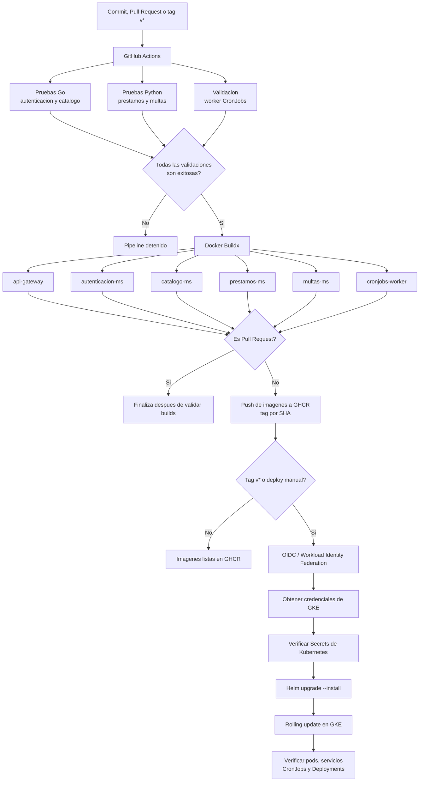
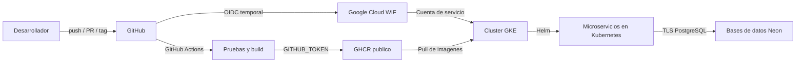

# Diagrama del pipeline CI/CD

```mermaid
flowchart TD
    A[Commit, Pull Request o tag v*] --> B[GitHub Actions]
    B --> C1[Pruebas Go<br/>autenticacion y catalogo]
    B --> C2[Pruebas Python<br/>prestamos y multas]
    B --> C3[Validacion<br/>worker CronJobs]
    C1 --> D{Todas las validaciones<br/>son exitosas?}
    C2 --> D
    C3 --> D
    D -- No --> E[Pipeline detenido]
    D -- Si --> F[Docker Buildx]
    F --> G1[api-gateway]
    F --> G2[autenticacion-ms]
    F --> G3[catalogo-ms]
    F --> G4[prestamos-ms]
    F --> G5[multas-ms]
    F --> G6[cronjobs-worker]
    G1 --> H{Es Pull Request?}
    G2 --> H
    G3 --> H
    G4 --> H
    G5 --> H
    G6 --> H
    H -- Si --> I[Finaliza despues de validar builds]
    H -- No --> J[Push de imagenes a GHCR<br/>tag por SHA]
    J --> K{Tag v* o deploy manual?}
    K -- No --> L[Imagenes listas en GHCR]
    K -- Si --> M[OIDC / Workload Identity Federation]
    M --> N[Obtener credenciales de GKE]
    N --> O[Verificar Secrets de Kubernetes]
    O --> P[Helm upgrade --install]
    P --> Q[Rolling update en GKE]
    Q --> R[Verificar pods, servicios<br/>CronJobs y Deployments]
```

## Responsabilidad de cada plataforma

```mermaid
flowchart LR
    DEV[Desarrollador] -->|push / PR / tag| GITHUB[GitHub]
    GITHUB -->|GitHub Actions| TESTS[Pruebas y build]
    TESTS -->|GITHUB_TOKEN| GHCR[GHCR publico]
    GITHUB -->|OIDC temporal| WIF[Google Cloud WIF]
    WIF -->|Cuenta de servicio| GKE[Cluster GKE]
    GHCR -->|Pull de imagenes| GKE
    GKE -->|Helm| K8S[Microservicios en Kubernetes]
    K8S -->|TLS PostgreSQL| NEON[Bases de datos Neon]
```
