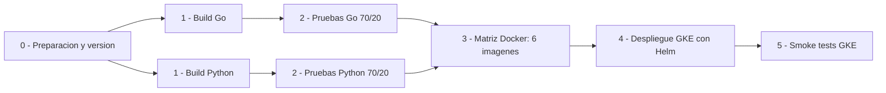

# Diagrama del pipeline CI/CD

El grafo ejecutado por GitHub Actions sigue estas dependencias:

Las matrices agrupan varios jobs equivalentes dentro de una sola caja visual. El
job de preparacion tambien falla si el repositorio deja de cumplir los minimos de
70 % de pruebas unitarias y 20 % de pruebas de integracion.
