# Practica 7 - Integracion y despliegue continuo

## Descripcion

Esta practica implementa un pipeline de integracion y despliegue continuo para
la plataforma de biblioteca desarrollada en las practicas anteriores. El
workflow ejecuta preparacion, compilacion, pruebas, construccion de imagenes,
publicacion en GitHub Container Registry (GHCR), despliegue con Helm en Google
Kubernetes Engine (GKE) y pruebas de humo sobre el ambiente publicado.

El archivo funcional del pipeline se encuentra en
`.github/workflows/p7-ci-cd.yml`, que es la ubicacion reconocida por GitHub
Actions. La ejecucion final corresponde al tag `v1.1.1`.

## Tecnologias utilizadas

- GitHub Actions para CI/CD.
- Go y Python para los microservicios.
- Docker y Docker Buildx para construir contenedores.
- GitHub Container Registry para publicar las imagenes.
- Google Kubernetes Engine como ambiente de despliegue.
- Helm para administrar los recursos de Kubernetes.
- Workload Identity Federation para autenticar GitHub en Google Cloud sin una
  llave JSON permanente.
- Neon PostgreSQL y Secrets de Kubernetes para las conexiones de datos.

## Diagrama del pipeline

El siguiente diagrama representa el flujo logico desde la preparacion hasta el
despliegue:

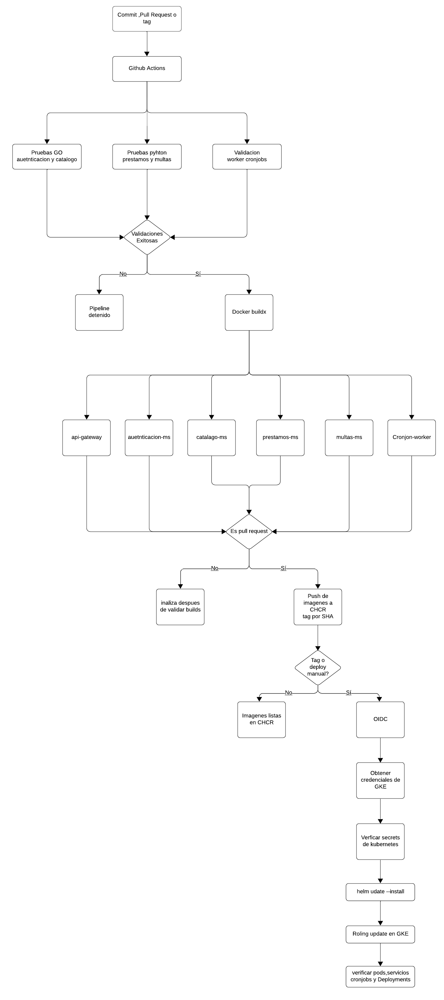

## Grafo de GitHub Actions

GitHub Actions genera el grafo a partir de los jobs y sus relaciones `needs`.
Las matrices agrupan los servicios equivalentes dentro de una sola etapa.

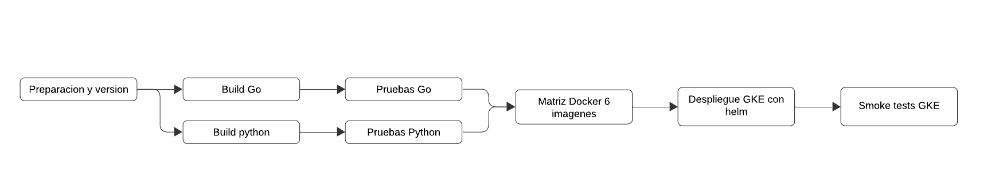

El orden implementado es:

1. `0 - Preparacion y version`: determina la version y valida la seleccion de
   pruebas.
2. `1 - Build Go` y `1 - Build Python`: compilan los servicios y el worker en
   paralelo.
3. `2 - Pruebas Go` y `2 - Pruebas Python`: ejecutan las pruebas seleccionadas.
4. `3 - Docker`: construye y publica seis imagenes mediante una matriz.
5. `4 - Despliegue GKE con Helm`: actualiza el release en el cluster.
6. `5 - Smoke tests GKE`: verifica los cinco endpoints de salud publicados.

## Disparadores del workflow

| Evento | Compilacion y pruebas | Publicacion en GHCR | Despliegue en GKE |
|---|---:|---:|---:|
| Pull request | Si | No | No |
| Push a `main` | Si | Si | No |
| Tag `v*` | Si | Si | Si |
| Ejecucion manual con `deploy=false` | Si | Si | No |
| Ejecucion manual con `deploy=true` | Si | Si | Si |

## Distribucion de pruebas

El pipeline ejecuta exactamente nueve casos seleccionados. El repositorio
conserva pruebas adicionales para desarrollo, pero no forman parte del conteo
solicitado para esta practica.

| Tipo | Cantidad | Porcentaje |
|---|---:|---:|
| Unitarias | 7 | 77.8 % |
| Integracion | 2 | 22.2 % |
| Total | 9 | 100 % |

Las pruebas unitarias cubren autenticacion, catalogo, prestamos y multas. Las
pruebas de integracion validan el endpoint HTTP de registro y una consulta
GraphQL de prestamos. El script
`P7/scripts/validate-test-distribution.py` comprueba que los nueve casos existan
y que se mantengan los minimos de 70 % unitarias y 20 % de integracion.

Comando de validacion:

```bash
python P7/scripts/validate-test-distribution.py
```

Resultado esperado:

```text
Pruebas seleccionadas: 9
Pruebas unitarias: 7/9 (77.8%)
Pruebas de integracion: 2/9 (22.2%)
Seleccion de 7 pruebas unitarias y 2 de integracion validada.
```

## Imagenes publicadas

Las imagenes utilizan el SHA del commit como etiqueta inmutable. Los pushes a
`main` tambien publican `latest` y los tags `v*` agregan la etiqueta de version.

- `ghcr.io/izabel05/sa-api-gateway`
- `ghcr.io/izabel05/sa-autenticacion-ms`
- `ghcr.io/izabel05/sa-catalogo-ms`
- `ghcr.io/izabel05/sa-prestamos-ms`
- `ghcr.io/izabel05/sa-multas-ms`
- `ghcr.io/izabel05/sa-cronjobs-worker`

Los seis paquetes tienen visibilidad publica para permitir que los nodos de GKE
descarguen las imagenes sin un `imagePullSecret`.

## Configuracion de Google Cloud

La practica utiliza la siguiente configuracion:

| Recurso | Valor |
|---|---|
| Proyecto | `p6202300582` |
| Cluster | `sa-p6-cluster` |
| Zona | `us-central1-a` |
| Tipo de nodo | `e2-standard-2` |
| Numero de nodos | 1 |
| Namespace | `sa-p6` |
| Release de Helm | `sa-platform` |

### Creacion del cluster

```bash
gcloud config set project p6202300582

gcloud container clusters create sa-p6-cluster \
  --project=p6202300582 \
  --zone=us-central1-a \
  --num-nodes=1 \
  --machine-type=e2-standard-2 \
  --disk-type=pd-balanced \
  --disk-size=30 \
  --enable-ip-alias \
  --release-channel=regular

gcloud container clusters get-credentials sa-p6-cluster \
  --project=p6202300582 \
  --zone=us-central1-a
```

### Workload Identity Federation

El pipeline se autentica mediante OIDC. Los unicos Secrets configurados en
GitHub Actions para GCP son:

- `GCP_WORKLOAD_IDENTITY_PROVIDER`
- `GCP_SERVICE_ACCOUNT`

La configuracion inicial puede reproducirse con:

```bash
chmod +x P7/scripts/01-configure-workload-identity.sh
P7/scripts/01-configure-workload-identity.sh
```

### Namespace y Secrets

La eliminacion de un cluster tambien elimina sus objetos de Kubernetes. Por
ello, despues de recrearlo se ejecuto:

```bash
chmod +x P7/scripts/02-bootstrap-cluster.sh
P7/scripts/02-bootstrap-cluster.sh
```

El script solicita de forma oculta las cinco URL de PostgreSQL y el JWT. Crea
los siguientes Secrets sin escribir valores sensibles en Git:

- `auth-postgresql-credentials`
- `catalog-postgresql-credentials`
- `loans-postgresql-credentials`
- `fines-postgresql-credentials`
- `cronjobs-postgresql-credentials`
- `jwt-credentials`

Para verificar solamente su existencia:

```bash
kubectl get secrets -n sa-p6
```

## Despliegue y comprobaciones

El despliegue final se activo con una etiqueta inmutable:

```bash
git tag -a v1.1.1 -m "P7: nueve pruebas y smoke GKE corregido"
git push origin v1.1.1
```

El workflow ejecuta `helm dependency build` y posteriormente
`helm upgrade --install`. Para revisar manualmente el ambiente se utilizaron:

```bash
kubectl get nodes
kubectl get pods,services,cronjobs -n sa-p6 -o wide
kubectl rollout status deployment/api-gateway -n sa-p6
```

El Service del API Gateway publica el puerto `8080`. Los smoke tests obtienen la
IP y el puerto directamente desde Kubernetes para no asumir incorrectamente el
puerto 80:

```bash
IP=$(kubectl -n sa-p6 get svc api-gateway \
  -o jsonpath='{.status.loadBalancer.ingress[0].ip}')
PORT=$(kubectl -n sa-p6 get svc api-gateway \
  -o jsonpath='{.spec.ports[0].port}')

for ruta in /health /health/auth /health/catalogo /health/prestamos /health/multas; do
  printf "%s -> " "$ruta"
  curl -sS -o /dev/null -w '%{http_code}\n' "http://$IP:$PORT$ruta"
done
```

Las cinco rutas devolvieron HTTP `200` en la ejecucion final.

## Evidencias

### 1. Pipeline completo

La ejecucion del tag `v1.1.1` finalizo correctamente en todas sus etapas, desde
la preparacion hasta los smoke tests.

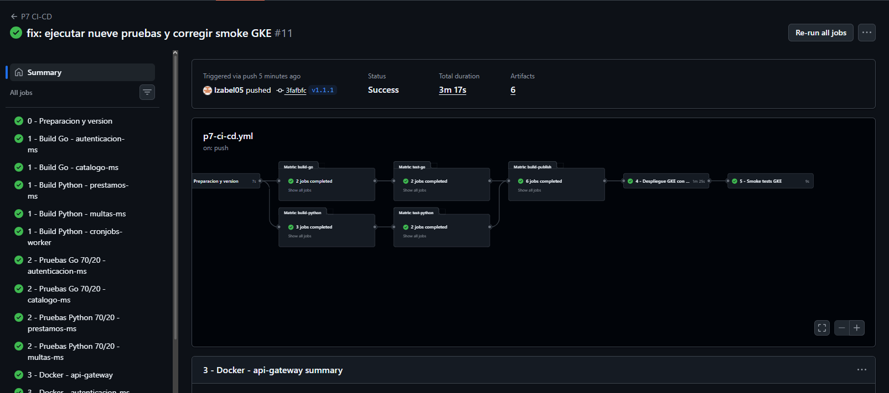

### 2. Distribucion de pruebas

La etapa de preparacion confirma los nueve casos seleccionados: siete unitarios
y dos de integracion.

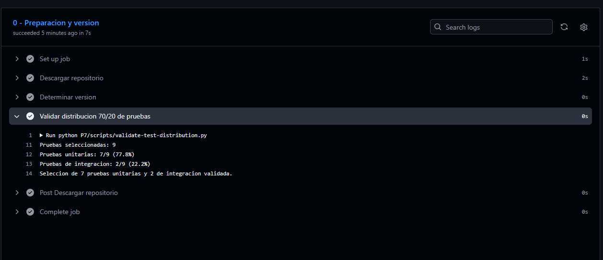

### 3. Pruebas exitosas

Los jobs de Go y Python terminaron correctamente para los microservicios
seleccionados.

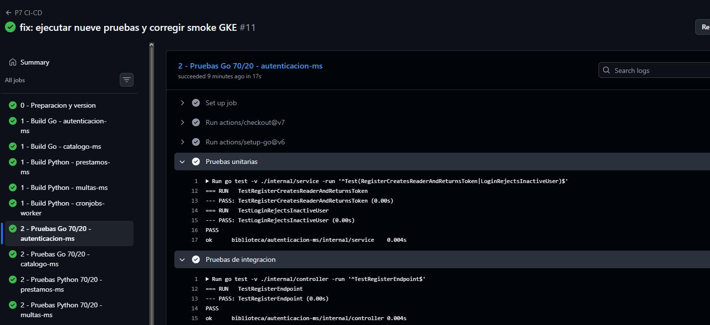

### 4. Construccion de imagenes

La matriz Docker construyo y publico las seis imagenes sin errores.

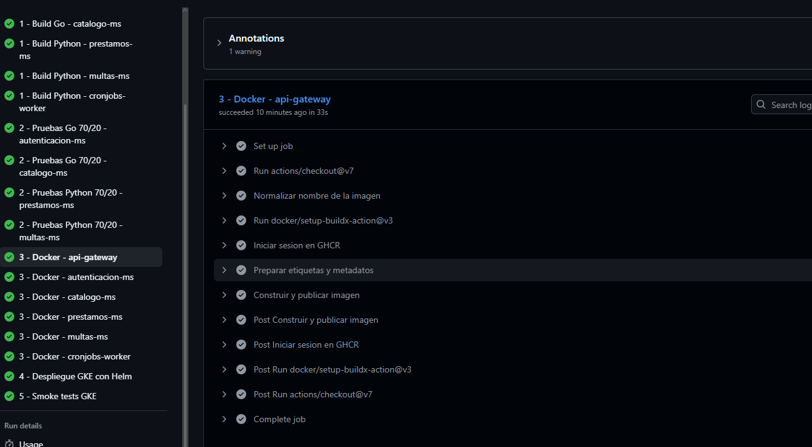

### 5. Imagenes publicas

Los paquetes se encuentran publicados en GHCR con visibilidad publica.

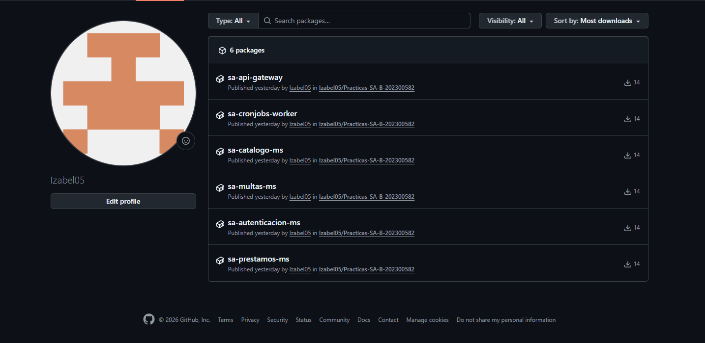

### 6. Despliegue y smoke tests

El despliegue con Helm y los smoke tests finalizaron en estado exitoso.

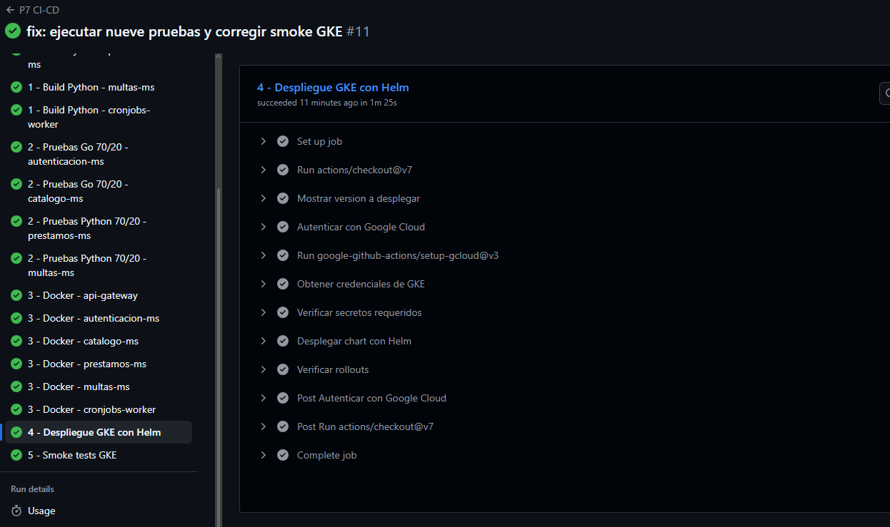

### 7. Cluster de GKE

El cluster `sa-p6-cluster` aparece en ejecucion en la zona `us-central1-a`.

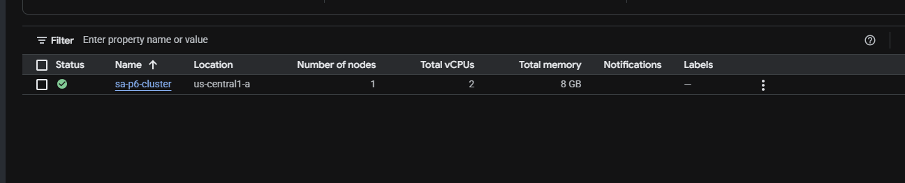

### 8. Recursos de Kubernetes

Los pods, Services y CronJobs del namespace `sa-p6` se encuentran desplegados.

```bash
kubectl get nodes
kubectl get pods,services,cronjobs -n sa-p6 -o wide
```

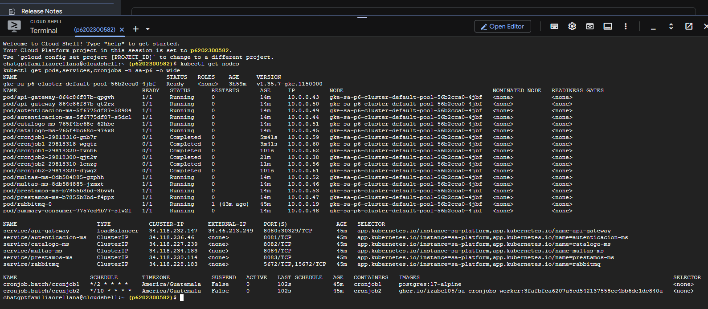

### 9. Endpoints publicados

Los cinco endpoints de salud del API Gateway respondieron con codigo HTTP 200.

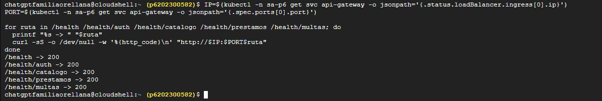

## Preguntas teoricas

### 1. ¿Cual es la diferencia entre integracion continua y despliegue continuo?

La integracion continua valida cada cambio mediante compilacion y pruebas
automaticas para detectar errores tempranamente. El despliegue continuo toma un
artefacto previamente validado y actualiza un ambiente de ejecucion de forma
automatizada. En este pipeline, la compilacion y las pruebas representan CI; la
publicacion en GHCR y el despliegue con Helm representan CD.

### 2. ¿Cuales son los beneficios de automatizar las pruebas y la construccion de imagenes?

La automatizacion hace repetible el proceso, reduce errores manuales y evita
desplegar cambios que no compilan o que no superan las pruebas. Ademas, una
imagen identificada mediante el SHA permite relacionar exactamente un
contenedor con el commit que lo produjo.

### 3. ¿Cual es la funcion de un registro de contenedores?

Un registro conserva y distribuye imagenes versionadas. GHCR funciona como el
punto de intercambio entre GitHub Actions, que construye y publica las imagenes,
y GKE, que las descarga para ejecutar los microservicios.

### 4. ¿Por que es importante el versionamiento en CI/CD?

Las etiquetas basadas en SHA son inmutables y permiten auditoria y rollback. La
etiqueta `latest` identifica la version mas reciente de `main`, mientras que los
tags `v*` representan versiones seleccionadas deliberadamente para despliegue.

### 5. ¿Como se manejan de forma segura las credenciales?

Las conexiones de Neon se almacenan como Secrets de Kubernetes y nunca se
escriben en Git. GitHub se autentica en GCP mediante OIDC y Workload Identity
Federation, por lo que no existe una llave JSON permanente en el repositorio ni
en GitHub Actions. Las evidencias tampoco muestran valores sensibles.

## Resultado final

La ejecucion final del tag `v1.1.1` completo exitosamente las etapas de CI/CD,
publico las seis imagenes, desplego la plataforma en GKE y valido los cinco
endpoints de salud. La ejecucion puede consultarse en:

<https://github.com/Izabel05/Practicas-SA-B-202300582/actions/runs/34559574211>
