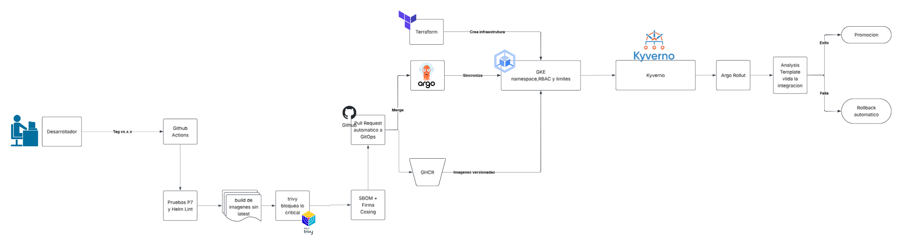
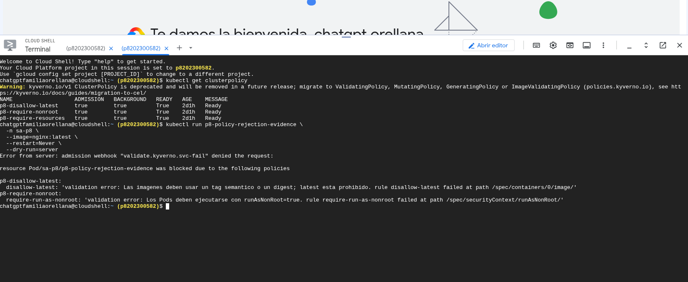
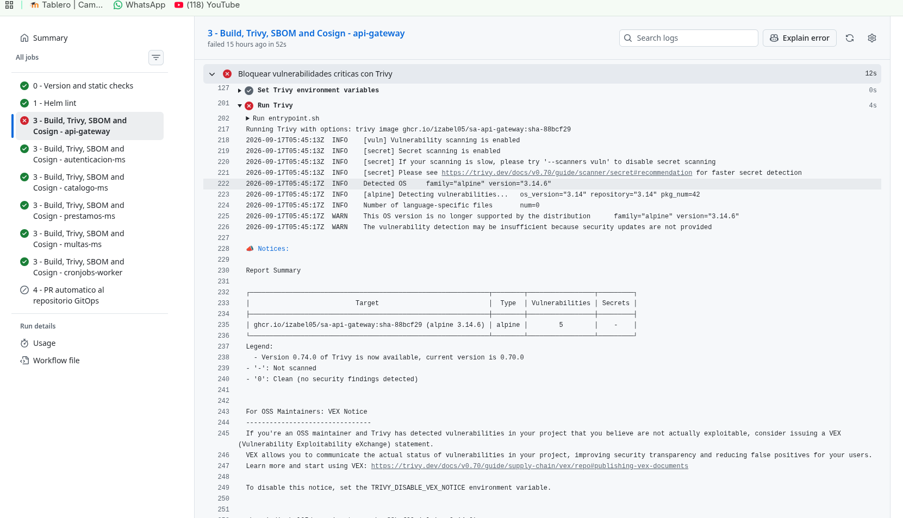
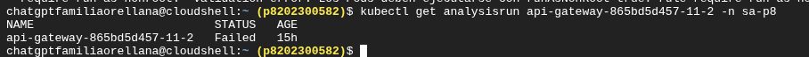
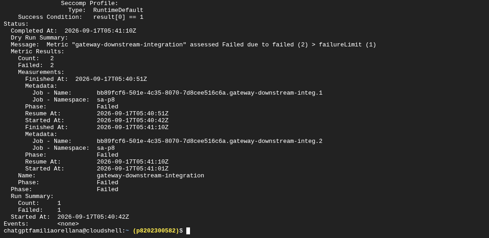
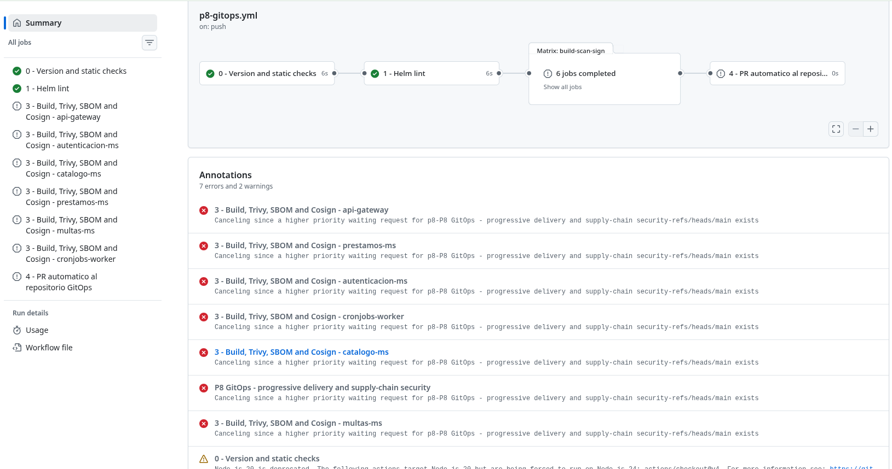
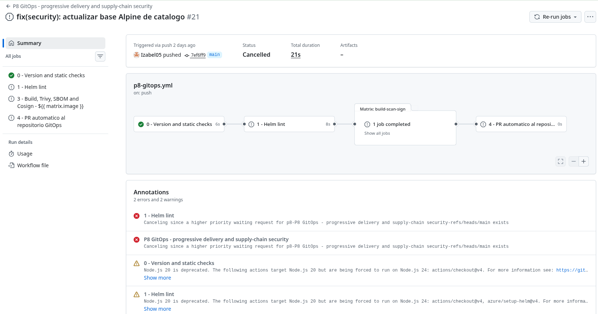

# Practica 8 - GitOps, entrega progresiva y seguridad

Esta carpeta contiene la implementación de P8 sobre los microservicios de P5,
P6 y P7. El repositorio de código contiene los workflows y el chart de
referencia; el repositorio GitOps independiente contiene el chart declarativo
que ArgoCD sincroniza con Kubernetes.

## Repositorios

| Elemento | URL o ubicación |
|---|---|
| Código y workflows | https://github.com/Izabel05/Practicas-SA-B-202300582 |
| Repositorio GitOps | https://github.com/Izabel05/GItOps_202300582 |
| Aplicación ArgoCD | `sa-platform-p8` / namespace `sa-p8` |

## Tabla de enlaces obligatoria

| Ítem | Enlace o dato requerido |
|---|---|
| Repositorio GitOps | https://github.com/Izabel05/GItOps_202300582 |
| Aplicación en ArgoCD | `sa-platform-p8`, namespace `sa-p8` |
| Ejecución exitosa del pipeline | https://github.com/Izabel05/Practicas-SA-B-202300582/actions/runs/35185935349 |
| Reversión automática | PR GitOps [#20](https://github.com/Izabel05/GItOps_202300582/pull/20), restauración [#21](https://github.com/Izabel05/GItOps_202300582/pull/21) e informe `P8/docs/informe-incidente.md` |
| Despliegue rechazado por política | Evidencia documentada en `P8/docs/evidencias-controles.md` |
| Bloqueo por vulnerabilidad crítica | PR cerrado sin fusionar [#4](https://github.com/Izabel05/Practicas-SA-B-202300582/pull/4) y [ejecución #80](https://github.com/Izabel05/Practicas-SA-B-202300582/actions/runs/35186897878) |
| Imagen firmada | `ghcr.io/izabel05/sa-<servicio>:vX.Y.Z` |
| Reporte de prueba de carga | No aplica: excluida del alcance actualizado |
| Video demostrativo | Pendiente de grabar; agregar URL y minutaje |

## Flujo implementado


## Componentes

- `charts/sa-platform`: chart Helm declarativo únicamente para la aplicación:
  Rollout/Deployments, Services, ConfigMaps, HPA, ExternalSecrets y políticas
  de ejecución. El canary y la versión estable conviven en `sa-p8`.
- `terraform`: reconstrucción del perfil Minikube de prueba y recursos de
  infraestructura Kubernetes: namespace, ResourceQuota, LimitRange, cuentas,
  Roles y RoleBindings. También contiene el modo GKE opcional, con red VPC,
  subredes secundarias, clúster Standard y node pool.
- `policies/kyverno-policies.yaml`: las tres políticas obligatorias de P8.
- `.github/workflows/p8-gitops.yml`: pipeline sin credenciales de clúster ni
  despliegue directo; únicamente genera un PR de promoción al repositorio
  GitOps cuando se publica una etiqueta semver.

## Restricción de despliegue

Ningún workflow configura acceso al clúster ni ejecuta comandos de aplicación
o actualización de recursos. El pipeline construye, analiza y firma imágenes,
y únicamente actualiza las etiquetas del repositorio GitOps mediante un Pull
Request automático. ArgoCD es el único componente autorizado para sincronizar
los manifiestos en Kubernetes. El namespace, las quotas, los LimitRanges y el
RBAC son administrados por Terraform.

## Secretos

Los charts no generan secretos con valores en el repositorio. Se esperan siete
`ExternalSecret` respaldados por un `ClusterSecretStore` llamado
`cluster-secret-store`. Cada clave remota `p8-<secret>` debe contener un JSON
con los campos que necesita el `Secret` de Kubernetes (por ejemplo,
`database-url`, `postgres-user` y `postgres-password`). El chart usa
`dataFrom.extract` para conservar una sola entrada por secreto lógico.

El pipeline requiere el secreto de GitHub Actions `GITOPS_TOKEN`, limitado al
repositorio `Izabel05/GItOps_202300582`, para abrir el PR automático.

## Validación local

```bash
helm dependency build P8/charts/sa-platform
helm lint P8/charts/sa-platform -f P8/charts/sa-platform/values-p8.yaml
terraform -chdir=P8/terraform init
terraform -chdir=P8/terraform validate
python P7/scripts/validate-test-distribution.py
```

## Preparación de GKE

El archivo `terraform/cloud.tfvars.example` muestra la configuración para el
proyecto `p8202300582`. Copiarlo como `cloud.tfvars` sin subir ese archivo al
repositorio. Antes de aplicar en Google Cloud se debe asociar facturación,
habilitar las APIs requeridas y autenticar Terraform con ADC. El estado de esta
ejecución debe ser independiente del estado de la prueba Minikube.

Como el proveedor Kubernetes necesita el contexto de GKE después de crear el
clúster, la aplicación de infraestructura se hace en dos fases desde una
terminal autorizada del administrador:

```bash
terraform -chdir=P8/terraform init
terraform -chdir=P8/terraform plan -target=google_container_node_pool.primary -var-file=cloud.tfvars
terraform -chdir=P8/terraform apply -target=google_container_node_pool.primary -var-file=cloud.tfvars
gcloud container clusters get-credentials p8-202300582 \
  --zone us-central1-a --project p8202300582
terraform -chdir=P8/terraform plan -var-file=cloud.tfvars
terraform -chdir=P8/terraform apply -var-file=cloud.tfvars
```

El clúster GKE no se crea hasta ejecutar explícitamente `apply` con ese archivo;
la prueba local usa `manage_minikube=true` y no requiere facturación.

## Estado verificado en GKE

La aplicación `sa-platform-p8` fue verificada en estado `Synced` y `Healthy`.
El Rollout del API Gateway completó las etapas 20 %, 50 % y 80 %, y las tres
ejecuciones del `AnalysisTemplate` de integración terminaron correctamente.
Los ocho `ExternalSecret` se encuentran sincronizados y las tres políticas de
Kyverno están activas. No se ejecutan pruebas de carga ni pruebas de humo,
conforme a la excepción establecida para esta práctica.

La captura o URL pública de la demostración, el fallo inducido final y el video
deben agregarse a la tabla de enlaces antes de la entrega.

## Informe de incidente

### Rechazo de política Kyverno

El 17 de septiembre de 2026 se envió un Pod únicamente con
`--dry-run=server`; ningún recurso quedó persistido. Kyverno rechazó
`nginx:latest` por `p8-disallow-latest` y la ausencia de
`runAsNonRoot: true` por `p8-require-nonroot`.

```text
resource Pod/sa-p8/p8-policy-rejection-evidence was blocked
p8-disallow-latest: latest esta prohibido
p8-require-nonroot: runAsNonRoot=true es obligatorio
```



### Bloqueo de vulnerabilidad crítica

El PR de evidencia [#4](https://github.com/Izabel05/Practicas-SA-B-202300582/pull/4)
usó deliberadamente una base obsoleta y se cerró sin fusionar. En la
[ejecución #80](https://github.com/Izabel05/Practicas-SA-B-202300582/actions/runs/35186897878),
el job `api-gateway` falló exactamente en
`Bloquear vulnerabilidades criticas con Trivy`; las otras cinco imágenes
terminaron correctamente y el job de promoción GitOps fue omitido.




### Rollback automático

El fallo controlado está trazado en los PR GitOps
[#20](https://github.com/Izabel05/GItOps_202300582/pull/20) y
[#21](https://github.com/Izabel05/GItOps_202300582/pull/21). El AnalysisRun
`api-gateway-865bd5d457-11-2` terminó `Failed`; Argo Rollouts reportó
`RolloutAborted`, mantuvo estable `7fd7f76d74` y no promovió el canary.










