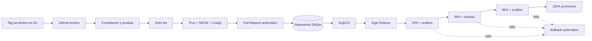

# Diagrama del flujo GitOps

```mermaid
flowchart LR
  C[Tag semántico en Git] --> CI[GitHub Actions]
  CI --> T[Compilación y pruebas]
  T --> H[helm lint]
  H --> S[Trivy + SBOM + Cosign]
  S --> PR[Pull Request automático]
  PR --> G[(Repositorio GitOps)]
  G --> A[ArgoCD]
  A --> R[Argo Rollouts]
  R --> P1[20% + análisis]
  P1 --> P2[50% + análisis]
  P2 --> P3[80% + análisis]
  P3 --> OK[100% promoción]
  P1 -. falla .-> RB[Rollback automático]
  P2 -. falla .-> RB
  P3 -. falla .-> RB
```

ArgoCD es el único componente que aplica el estado declarado al clúster. El
pipeline solo construye/verifica artefactos y propone el cambio mediante PR.
