# Práctica 9 - Continuidad operativa y recuperación ante desastres

## Objetivo

P9 conserva el backend funcional de P8 y agrega continuidad operativa para la
plataforma desplegada en GKE. Terraform crea la infraestructura, ArgoCD realiza
el bootstrap GitOps y Velero respalda y restaura los datos persistentes.

La prueba demuestra que el clúster puede reconstruirse mediante Terraform y que
los datos reales pueden recuperarse desde un respaldo almacenado fuera del
clúster.
## Diagrama de bootstrap

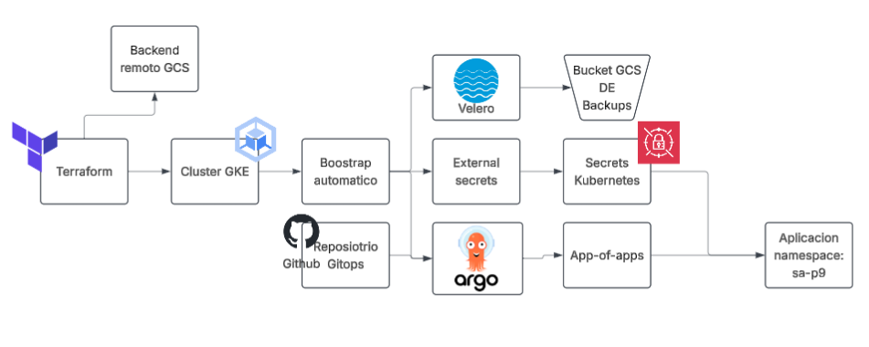

## Componentes

| Componente | Función |
|---|---|
| Terraform | Crea red, clúster, node pool, cuentas de servicio y buckets. |
| Bootstrap | Instala ArgoCD, External Secrets y Velero, y aplica el app-of-apps. |
| ArgoCD | Sincroniza el repositorio GitOps con el namespace <code>sa-p9</code>. |
| PostgreSQL | Conserva datos reales en un PVC. |
| RabbitMQ | Conserva su cola en un PVC. |
| Velero | Realiza backups y restores de Kubernetes y de los PVC. |
| GCS | Almacena el estado remoto de Terraform y los backups de Velero. |

## Repositorios y configuración

| Elemento | Valor |
|---|---|
| Repositorio principal | https://github.com/Izabel05/Practicas-SA-B-202300582 |
| Repositorio GitOps | https://github.com/Izabel05/GItOps_202300582 |
| Proyecto GCP | <code>p8202300582</code> |
| Clúster | <code>p9-202300582</code> |
| Zona | <code>us-central1-a</code> |
| Namespace de aplicación | <code>sa-p9</code> |
| Namespace de Velero | <code>velero</code> |
| Bucket de Velero | <code>p9-velero-backups-202300582</code> |
| Aplicación raíz de ArgoCD | <code>sa-platform-p9-root</code> |
| Aplicación de plataforma | <code>sa-platform-p9</code> |

## Tabla de enlaces obligatoria

| Ítem | Enlace o dato requerido |
|---|---|
| Repositorio GitOps | https://github.com/Izabel05/GItOps_202300582 |
| Aplicación raíz de ArgoCD | <code>sa-platform-p9-root</code>, namespace <code>argocd</code> |
| Punto de entrada del bootstrap | <code>P9/terraform/bootstrap-gke.sh.tftpl</code>, ejecutado por Terraform |
| Backend remoto de Terraform | GCS: <code>p9-terraform-state-202300582</code>, prefijo <code>terraform/p9</code> |
| Schedule de Velero | <code>p9-daily</code>, <code>0 2 * * *</code>, bucket <code>p9-velero-backups-202300582</code>, TTL <code>720h</code> |
| Reconstrucción cronometrada | Sección <code>Reconstrucción cronometrada</code> de este README |
| Restauración de datos | Sección <code>Restauración de datos</code> e imagen <code>image-19.png</code> |
| Prueba de pérdida de nodo | Sección <code>Pérdida de nodo</code> e imágenes <code>image-14.png</code> a <code>image-17.png</code> |
| RTO y RPO | Objetivo RTO: 60 minutos; objetivo RPO: 24 horas; valores medidos abajo |
| Video demostrativo | https://drive.google.com/file/d/1dB7pvMRKumowT3EvoAFqj8UDgtHOYvKk/view?usp=sharing minutaje: 5:46 |

## Terraform y node pools

El estado remoto de Terraform se configura mediante el archivo local
<code>terraform/backend.hcl</code>, que no debe subirse al repositorio.

El archivo <code>terraform/gke.tf</code> declara
<code>remove_default_node_pool = true</code> y el node pool
<code>p9-202300582-nodes</code>. El recurso
<code>terraform_data.remove_default_node_pool</code> elimina de forma
idempotente un <code>default-pool</code> residual después de una interrupción.

    terraform plan -var-file=cloud.tfvars
    terraform apply -var-file=cloud.tfvars
    gcloud container clusters get-credentials p9-202300582 \
      --zone us-central1-a --project p8202300582

El resultado esperado del plan estable es:

    No changes. Your infrastructure matches the configuration.

## Bootstrap automático

El flujo de bootstrap es:

    Terraform -> GKE -> ArgoCD -> External Secrets -> Velero
             -> app-of-apps -> sa-platform-p9

Después de ejecutar Terraform no se aplican manualmente los manifiestos de la
aplicación. ArgoCD es quien sincroniza el repositorio GitOps.

Orden de reconstrucción:

    Terraform
      -> red y GKE
      -> ArgoCD y External Secrets
      -> Velero y BackupStorageLocation
      -> app-of-apps
      -> sa-platform-p9
      -> Rollouts, PVC, secrets y servicios

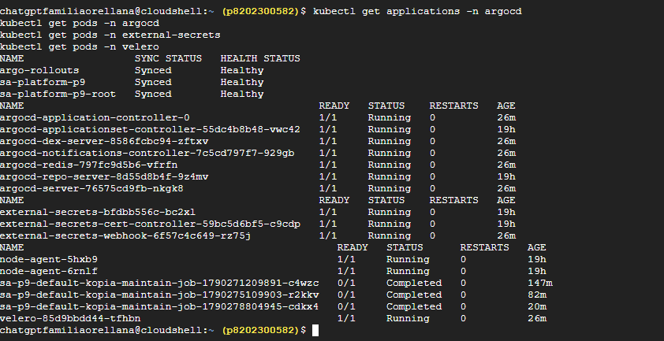

## Velero: servidor del clúster y cliente CLI de Cloud Shell

Velero tiene dos partes diferentes:

1. Los componentes dentro del clúster: <code>velero-server</code>,
   <code>node-agent</code>, CRDs, BackupStorageLocation, Backup y Restore.
2. El ejecutable <code>velero</code> instalado en Google Cloud Shell.

Por eso, el error de <code>velero version</code> en Cloud Shell no demuestra que
Velero falte en Kubernetes. La captura <code>image-10.png</code> demuestra que
el servidor sí estaba instalado: muestra el pod de Velero, dos node-agents y
los jobs de mantenimiento.

Para comprobar Velero dentro del clúster:

    kubectl get pods -n velero
    kubectl get crd | grep velero
    kubectl get backupstoragelocation -n velero

Para comprobar el cliente dentro de Cloud Shell:

    velero version --client-only
    velero backup get
    velero restore get

Si Cloud Shell responde <code>command not found: velero</code>, únicamente falta
instalar el CLI y agregarlo al <code>PATH</code>. El bootstrap instala el
servidor mediante Helm:

    helm upgrade --install velero vmware-tanzu/velero \
      --namespace velero --create-namespace \
      --values /tmp/p9-velero-values.yaml --wait

## Backup y restore comprobados

Backup real utilizado:

    p9-real-data-20260923115216

    Phase: Completed
    Errors: 0
    Warnings: 6

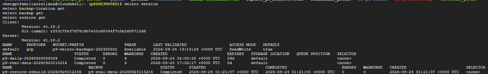
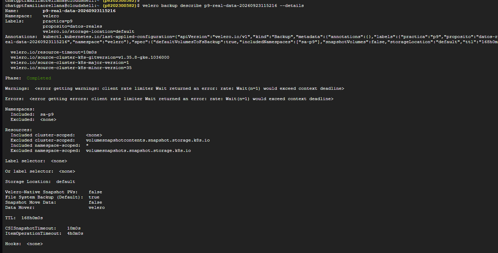

Restore posterior a la reconstrucción:

    p9-restore-rebuild-20260924012106

    Phase: Completed
    Errors: 0
    Warnings: 0

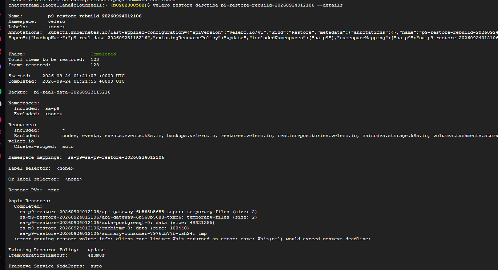

## Restauración de datos

El restore se realizó en un namespace temporal para no sobrescribir la
aplicación activa. Los cinco PodVolumeRestore terminaron correctamente y los
PVC restaurados quedaron en estado Bound.

La consulta se realizó en <code>auth_db</code>, tabla <code>usuarios</code>:

    SELECT id_usuario, nombre, apellido, correo, activo
    FROM usuarios;

    Registro verificado:

    11111111-1111-1111-1111-111111111111 | Paula | Bibliotecaria
    | paula.p9.202300582@biblioteca.local | t

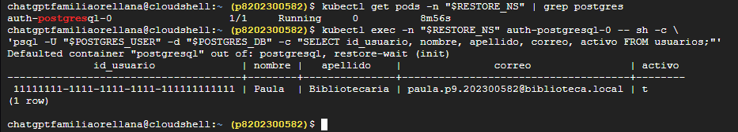

### Namespace temporal de restauración

La consulta de verificación debe ejecutarse en el namespace temporal que aparece
en el mapeo del restore. El nombre no se debe deducir a partir del nombre del
recurso Restore. Para identificarlo se utilizan:

    velero restore describe NOMBRE_DEL_RESTORE --details
    kubectl get pods -A | grep auth-postgresql-0

El resultado esperado es un pod
<code>auth-postgresql-0</code> dentro de un namespace que comienza con
<code>sa-p9-restore-</code>. La consulta se ejecuta así:

    export RESTORE_NS=NAMESPACE_TEMPORAL_REAL
    kubectl exec -n "$RESTORE_NS" auth-postgresql-0 -- sh -c \
      'psql -U "$POSTGRES_USER" -d "$POSTGRES_DB" \
      -c "SELECT id_usuario, nombre, apellido, correo, activo FROM usuarios;"'

El namespace <code>sa-p9</code> corresponde a la aplicación activa y no debe
usarse como evidencia de una restauración aislada. Que la consulta en
<code>sa-p9</code> devuelva <code>(0 rows)</code> no invalida el backup: significa
que la aplicación activa no fue sobrescrita.

Después de guardar las capturas y comprobar los datos, el namespace temporal se
puede eliminar sin afectar el backup ni el historial de Velero:

    kubectl delete namespace "$RESTORE_NS"

## Explicación de las capturas y comandos

### Rollout saludable

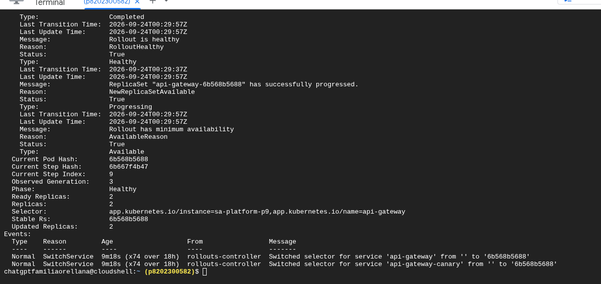

Comando: <code>kubectl describe rollout api-gateway -n sa-p9</code>.
Demuestra que el Rollout terminó en fase Healthy y tiene sus réplicas
disponibles.

### Rollout desplegado

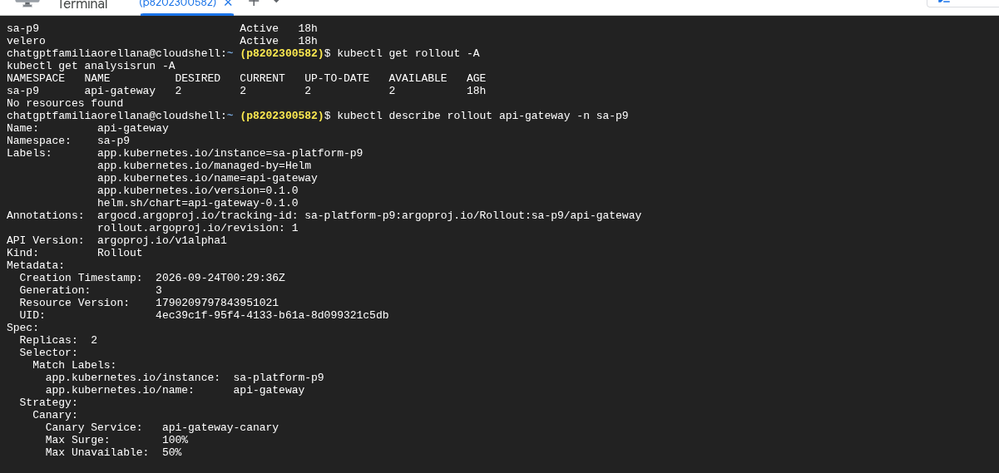

Comandos: <code>kubectl get rollout -A</code> y
<code>kubectl describe rollout api-gateway -n sa-p9</code>.
Demuestra que el Rollout existe en <code>sa-p9</code> y tiene sus réplicas
listas. El texto <code>unknown command argo for kubectl</code> corresponde a
un plugin opcional; conviene recortarlo o repetir la captura sin ese error.

### AnalysisTemplate

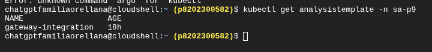

Comando: <code>kubectl get analysistemplate -n sa-p9</code>.
Demuestra que <code>gateway-integration</code> está creado.

### Configuración del análisis

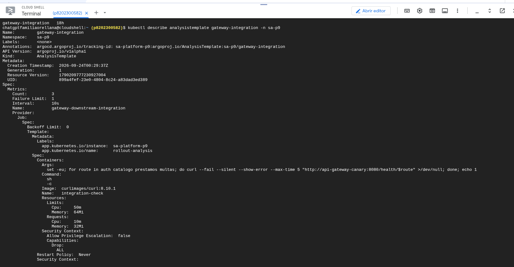

Comando: <code>kubectl describe analysistemplate gateway-integration -n sa-p9</code>.
Demuestra tres métricas, límite de fallo uno y consultas a los endpoints de
autenticación, catálogo, préstamos y multas.

### ReplicaSets

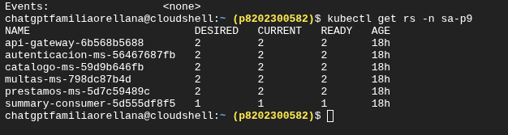

Comando: <code>kubectl get rs -n sa-p9</code>.
Demuestra las réplicas deseadas, actuales y listas de cada servicio.

### Imágenes desplegadas

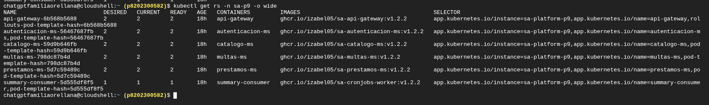

Comando: <code>kubectl get rs -n sa-p9 -o wide</code>.
Muestra las imágenes utilizadas y los selectores de cada ReplicaSet.

### Pods de la plataforma

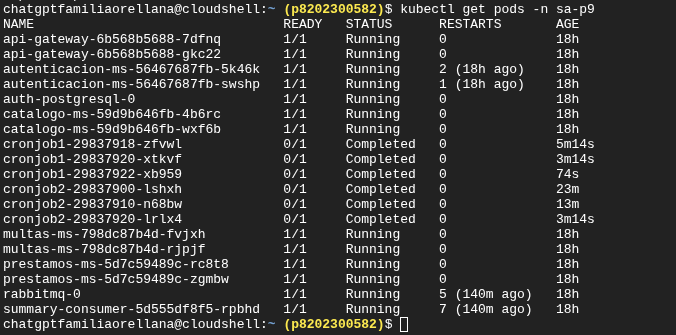

Comando: <code>kubectl get pods -n sa-p9</code>.
Demuestra que los microservicios, PostgreSQL y RabbitMQ están Running y que los
CronJobs terminan en Completed.

### PVC

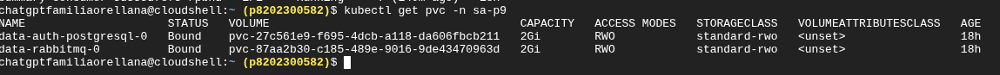

Comando: <code>kubectl get pvc -n sa-p9</code>.
Demuestra que los PVC de PostgreSQL y RabbitMQ están Bound, con 2 GiB y la
clase <code>standard-rwo</code>.

### PostgreSQL

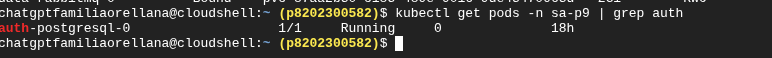

Comando: <code>kubectl get pods -n sa-p9 | grep auth</code>.
Confirma que <code>auth-postgresql-0</code> está Running. Una captura más limpia
puede usar <code>kubectl get pod auth-postgresql-0 -n sa-p9</code>.

### StatefulSets

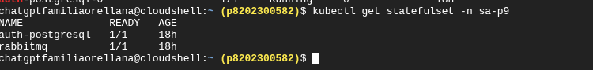

Comando: <code>kubectl get statefulset -n sa-p9</code>.
Demuestra que PostgreSQL y RabbitMQ tienen una réplica lista.

### Velero

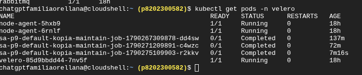

Comando: <code>kubectl get pods -n velero</code>.
Es la evidencia principal de que Velero está instalado dentro del clúster:
aparecen el servidor, los node-agents y los jobs de mantenimiento.

## Comandos finales para evidencias

    gcloud container node-pools list \
      --cluster p9-202300582 \
      --zone us-central1-a \
      --project p8202300582

    kubectl get nodes -L cloud.google.com/gke-nodepool

    kubectl get applications -n argocd \
      -o custom-columns=NAME:.metadata.name,SYNC:.status.sync.status,HEALTH:.status.health.status

    velero backup-location get
    velero backup get
    velero backup describe p9-real-data-20260923115216 --details
    velero restore get
    velero restore describe p9-restore-rebuild-20260924012106 --details

## Pérdida de nodo

La prueba de resiliencia drenó el nodo:

    kubectl get nodes
    kubectl get pods -n sa-p9 -o wide
    kubectl cordon NOMBRE_REAL_DEL_NODO
    kubectl drain NOMBRE_REAL_DEL_NODO \
      --ignore-daemonsets \
      --delete-emptydir-data \
      --timeout=10m

Durante el drenaje, Kubernetes expulsó los pods y los reprogramó en el nodo
disponible. Los servicios stateless mantuvieron sus réplicas y el Rollout del
API Gateway continuó disponible.

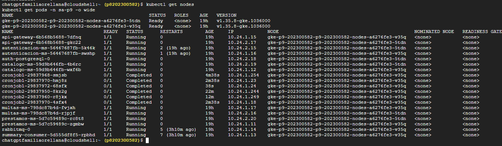

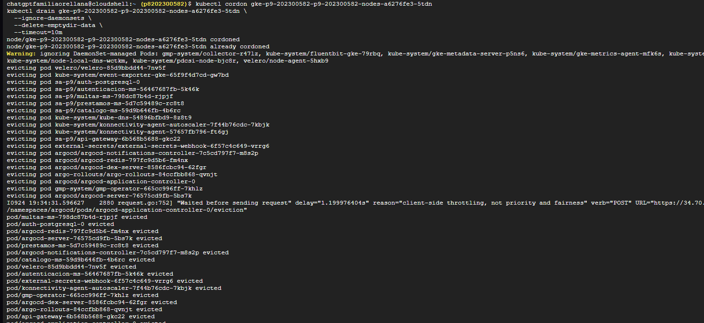

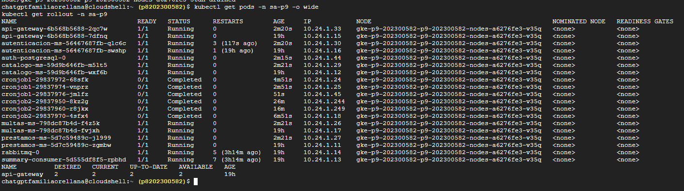

El nodo fue habilitado nuevamente con:

    kubectl uncordon NOMBRE_REAL_DEL_NODO

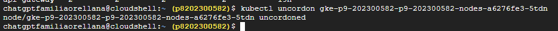

La configuración del chart incluye réplicas, PodDisruptionBudget y
anti-afinidad para los microservicios stateless. PostgreSQL y RabbitMQ son
StatefulSets de una réplica y se respaldan mediante Velero.

## Schedule y retención de Velero

El schedule programado es <code>p9-daily</code>:

    velero schedule get
    kubectl get schedule p9-daily -n velero -o yaml

La configuración verificada incluye:

    schedule: 0 2 * * *
    includedNamespaces:
      - sa-p9
    defaultVolumesToFsBackup: true
    ttl: 720h

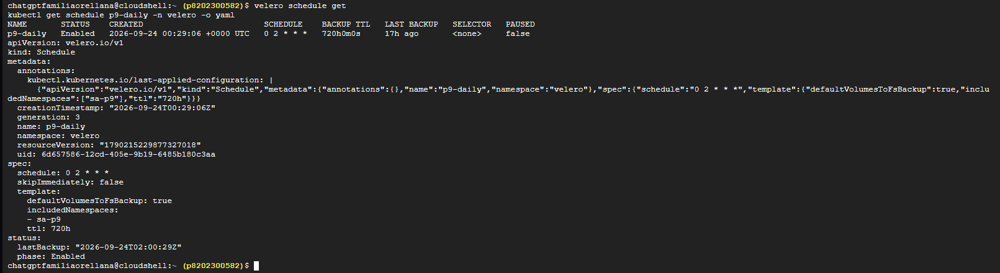

## Continuidad de secretos

Los secretos se obtienen desde Secret Manager mediante External Secrets. La
verificación posterior a la reconstrucción fue:

    kubectl get clustersecretstore
    kubectl get externalsecret -n sa-p9
    kubectl get secret -n sa-p9

El ClusterSecretStore quedó válido y los ExternalSecret quedaron en estado
<code>SecretSynced=True</code>. No se muestran valores sensibles.

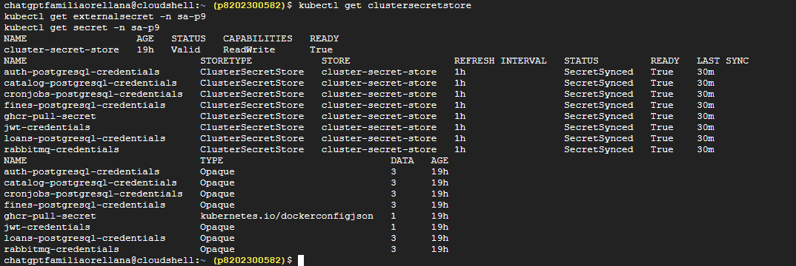

## Reconstrucción cronometrada

La reconstrucción se ejecutó desde Terraform. La primera ejecución tuvo una
pausa intencional porque el servidor fue apagado durante el procedimiento.
Por honestidad técnica se reportan tanto el tiempo total de pared como la
limitación de la medición continua.

    Inicio de destrucción:    2026-09-23T18:22:30Z
    Finalización del clúster: 2026-09-23T18:44:27Z
    Bootstrap completado:     2026-09-24T00:29:17Z
    Tiempo total de pared:    6h 06m 47s, incluyendo la pausa

El tiempo continuo de recuperación no puede declararse como una medición válida
porque la ejecución fue interrumpida. Para una medición estricta de RTO deberá
repetirse la reconstrucción sin apagar el servidor.

## Informe de la prueba de DR

### Objetivos declarados

- RTO objetivo: 60 minutos para reconstruir la plataforma funcional.
- RPO objetivo: 24 horas, correspondiente al respaldo programado diario.

### Escenario ejecutado

Se destruyó el entorno administrado por Terraform, se reconstruyó el clúster
GKE, se instaló automáticamente ArgoCD, External Secrets y Velero, y ArgoCD
levantó la plataforma mediante el app-of-apps. Posteriormente se probó el
drenaje controlado de un nodo y se restauraron datos desde Velero.

### Tiempos medidos

El tiempo total de pared fue de 6h 06m 47s, incluyendo una pausa intencional
por apagado del servidor. El clúster terminó operativo, con ArgoCD
<code>Synced/Healthy</code>.

### Pérdida medida

El backup utilizado tenía fecha de creación
<code>2026-09-23T17:52:17Z</code> y la destrucción comenzó a las
<code>2026-09-23T18:22:30Z</code>. La antigüedad máxima observable del backup
fue de aproximadamente 30 minutos y 13 segundos. El registro real de usuarios
fue recuperado correctamente.

### Puntos únicos de fallo detectados

- La continuidad de la medición depende de que el servidor permanezca encendido.
- La CLI de Velero no viene instalada por defecto en Cloud Shell, aunque el
  servidor sí esté instalado en Kubernetes.
- La medición de RTO debe repetirse sin la pausa para compararla justamente con
  el objetivo de 60 minutos.

### Brecha y plan

El tiempo total de pared superó el RTO objetivo debido a la pausa intencional.
La acción correctiva es repetir el ciclo completo sin apagar el servidor y
conservar las marcas de tiempo de destrucción, creación del clúster, bootstrap,
ArgoCD saludable y servicios disponibles.

## Runbook de recuperación

1. Abrir Google Cloud Shell y configurar el proyecto:

       gcloud config set project p8202300582

2. Obtener las credenciales del clúster:

       gcloud container clusters get-credentials p9-202300582 \
         --zone us-central1-a --project p8202300582

3. Entrar en la carpeta Terraform y verificar el backend remoto:

       cd P9202300582/P9/terraform
       terraform init -backend-config=backend.hcl
       terraform plan -var-file=cloud.tfvars

4. Aplicar Terraform. El bootstrap instala la plataforma sin aplicar
   manualmente los manifiestos:

       terraform apply -var-file=cloud.tfvars

5. Verificar ArgoCD:

       kubectl get applications -n argocd
       kubectl get pods -n argocd
       kubectl get pods -n external-secrets
       kubectl get pods -n velero

6. Verificar la aplicación:

       kubectl get pods -n sa-p9
       kubectl get pvc -n sa-p9
       kubectl get statefulset -n sa-p9

7. Verificar Velero:

       velero version
       velero backup-location get
       velero backup get
       velero restore get

8. Ejecutar una restauración aislada usando el backup real y verificar la
   consulta SQL antes de eliminar el namespace temporal.

9. Guardar las capturas en la carpeta raíz <code>P9/</code> y documentarlas
   únicamente en este README.

## Controles heredados de P8

P9 conserva GitOps, Argo Rollouts, Kyverno, External Secrets, políticas de
admisión y el flujo de promoción de P8. El rollback controlado de P8 está
documentado en los PR GitOps
[#20](https://github.com/Izabel05/GItOps_202300582/pull/20) y
[#21](https://github.com/Izabel05/GItOps_202300582/pull/21). El AnalysisRun
<code>api-gateway-865bd5d457-11-2</code> terminó en Failed y Argo Rollouts
conservó el ReplicaSet estable.

## Conclusión

Terraform reconstruye la infraestructura, ArgoCD recupera el estado declarativo,
External Secrets mantiene disponibles los secretos, Velero conserva los datos
fuera del clúster y Kubernetes mantiene la disponibilidad durante el drenaje
controlado de un nodo.
